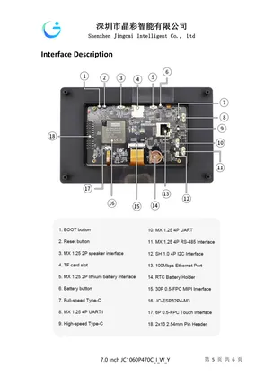

# JC1060P470C_I_W_Y

**Guition** · CYD

Revision: Not identified  
Coverage: Board labels only; pinout needed

[Browse all manufacturers](../../../../BROWSE.md) · [Desktop app](https://github.com/valleytechsolutions/black-wire-desktop)

## Board layout labels - PDF page 5

**board labeling image** · Reviewed source · PNG

[Open original reference](../../../../library/media/5dfa6c68bbba404bb2ad22ce7dc35ff2a92168a1210c2a622220c8c6df4cae54.png)

**Credit and rights:** Not established; source attribution retained. Source/manufacturer: Guition.

[Source 1](https://www.guition.com/icms/upload/fb081940d6fc11f09850077a33e1404f/FTPData/UEditor/file/2026121/1768961093646/JC1060P470C_I_W_Y Specifications-EN.pdf) · [Source 2](https://www.guition.com/-download)

Manufacturer-hosted board reference; select and review physical pinout pages before inclusion. Original PDF page 5 rendered at 220 dpi; no labels changed. This labels board components/connectors and is not a pin-by-pin signal map.

SHA-256: `5dfa6c68bbba404bb2ad22ce7dc35ff2a92168a1210c2a622220c8c6df4cae54`

## Manufacturer reference PDF

**original reference PDF** · Reviewed source · PDF

[Open original reference](../../../../library/media/a19323b7d9ee1af360b6d08c23e7b568ae13bbe150568a239da1885e3a75adb6.pdf)

**Credit and rights:** Not established; source attribution retained. Source/manufacturer: Guition.

[Source 1](https://www.guition.com/icms/upload/fb081940d6fc11f09850077a33e1404f/FTPData/UEditor/file/2026121/1768961093646/JC1060P470C_I_W_Y Specifications-EN.pdf) · [Source 2](https://www.guition.com/-download)

Manufacturer-hosted board reference; select and review physical pinout pages before inclusion.

SHA-256: `a19323b7d9ee1af360b6d08c23e7b568ae13bbe150568a239da1885e3a75adb6`

Pin assignments have not been independently electrically verified. Check board revision before wiring.
