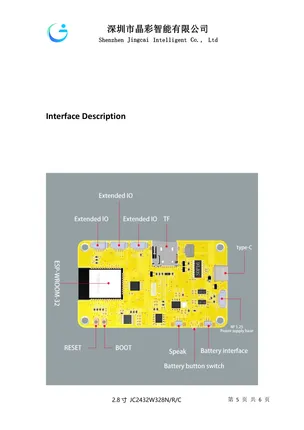
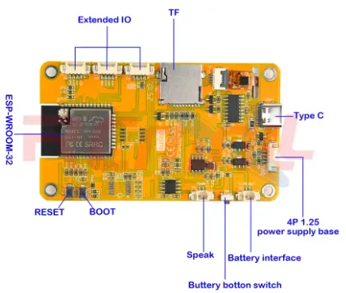

# JC2432W328

**Guition** · CYD

Revision: Not identified  
Coverage: Board labels only; pinout needed

[Browse all manufacturers](../../../../BROWSE.md) · [Desktop app](https://github.com/valleytechsolutions/black-wire-desktop)

## Board layout labels - PDF page 5

**board labeling image** · Reviewed source · PNG

[Open original reference](../../../../library/media/86dea812ea9c44a8958e670fe3014f0a250f5f57515cfc3353d230e70fa038bd.png)

**Credit and rights:** Not established; source attribution retained. Source/manufacturer: Guition.

[Source 1](https://www.guition.com/icms/upload/fb081940d6fc11f09850077a33e1404f/FTPData/UEditor/file/2026121/1768961094346/JC2432W328 Specifications-EN.pdf) · [Source 2](https://www.guition.com/-download)

Manufacturer-hosted board reference; select and review physical pinout pages before inclusion. Original PDF page 5 rendered at 220 dpi; no labels changed. This labels board components/connectors and is not a pin-by-pin signal map.

SHA-256: `86dea812ea9c44a8958e670fe3014f0a250f5f57515cfc3353d230e70fa038bd`

## Community board reference

**board labeling image** · Reviewed source · PNG

[Open original reference](../../../../library/media/e3ecc33d402b2b0868d2607ed0193dbef9ac9f04f3bc0a8264d67441570a82d1.png)

**Credit and rights:** Not established; source attribution retained. Source/manufacturer: Guition.

[Source 1](https://f1atb.fr/wp-content/uploads/2026/02/Capture-decran-2026-01-28-144453.png) · [Source 2](https://f1atb.fr/esp32-2432s028-esp32-2432s024-jc2432w328/)

Variant must be identified from this exact image and its surrounding source text.

SHA-256: `e3ecc33d402b2b0868d2607ed0193dbef9ac9f04f3bc0a8264d67441570a82d1`

## Manufacturer reference PDF

**original reference PDF** · Reviewed source · PDF

[Open original reference](../../../../library/media/3e209361bcdcf2faf807d3b462284e79155a6da0451f143ab5c9075cc24fec82.pdf)

**Credit and rights:** Not established; source attribution retained. Source/manufacturer: Guition.

[Source 1](https://www.guition.com/icms/upload/fb081940d6fc11f09850077a33e1404f/FTPData/UEditor/file/2026121/1768961094346/JC2432W328 Specifications-EN.pdf) · [Source 2](https://www.guition.com/-download)

Manufacturer-hosted board reference; select and review physical pinout pages before inclusion.

SHA-256: `3e209361bcdcf2faf807d3b462284e79155a6da0451f143ab5c9075cc24fec82`

Pin assignments have not been independently electrically verified. Check board revision before wiring.
