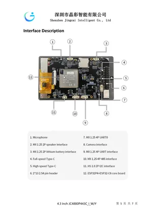

# JC4880P443C_I_W

**Guition** · CYD

Revision: Not identified  
Coverage: Board labels only; pinout needed

[Browse all manufacturers](../../../../BROWSE.md) · [Devices & IoT](../../../../DEVICES.md) · [Open in the browser guide](https://valleytech-black-wire-guide.pages.dev/?board=guition-cyd-jc4880p443c-i-w)

Device category: **Displays & HMI**

## Board layout labels - PDF page 5

**board labeling image** · Reviewed source · PNG

[Open original reference](../../../../library/media/0b152bea5a2f00307acf8c60670d201a0bd9eba24df8c38b5ca7d3041440a7a0.png)

**Credit and rights:** Not established; source attribution retained. Source/manufacturer: Guition.

[Source 1](https://www.guition.com/icms/upload/fb081940d6fc11f09850077a33e1404f/FTPData/UEditor/file/2026121/1768961095795/JC4880P443C_I_W Specifications-EN-V1.0.pdf) · [Source 2](https://www.guition.com/-download)

Manufacturer-hosted board reference; select and review physical pinout pages before inclusion. Original PDF page 5 rendered at 220 dpi; no labels changed. This labels board components/connectors and is not a pin-by-pin signal map.

Image revision: Not identified

SHA-256: `0b152bea5a2f00307acf8c60670d201a0bd9eba24df8c38b5ca7d3041440a7a0`

## Manufacturer reference PDF

**original reference PDF** · Reviewed source · PDF

[Open original reference](../../../../library/media/50306097eab8b1c4f709803508d5ad19d1f8c0c50ee8087b09e3af2731c94ca3.pdf)

**Credit and rights:** Not established; source attribution retained. Source/manufacturer: Guition.

[Source 1](https://www.guition.com/icms/upload/fb081940d6fc11f09850077a33e1404f/FTPData/UEditor/file/2026121/1768961095795/JC4880P443C_I_W Specifications-EN-V1.0.pdf) · [Source 2](https://www.guition.com/-download)

Manufacturer-hosted board reference; select and review physical pinout pages before inclusion.

Image revision: Not identified

SHA-256: `50306097eab8b1c4f709803508d5ad19d1f8c0c50ee8087b09e3af2731c94ca3`

Pin assignments have not been independently electrically verified. Check board revision before wiring.
