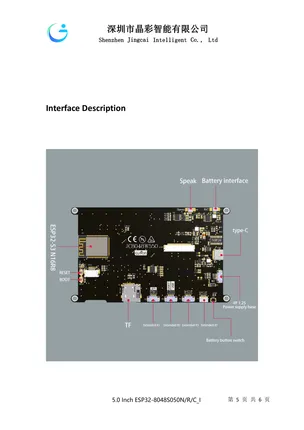

# JC8048W550

**Guition** · CYD

Revision: Not identified  
Coverage: Board labels only; pinout needed

[Browse all manufacturers](../../../../BROWSE.md) · [Desktop app](https://github.com/valleytechsolutions/black-wire-desktop)

## Board layout labels - PDF page 5

**board labeling image** · Reviewed source · PNG

[Open original reference](../../../../library/media/07dc613bf67ffae6ecc2881fa90f2d226f4f5c3fdfe88c5694a6a7fb971a8ddf.png)

**Credit and rights:** Not established; source attribution retained. Source/manufacturer: Guition.

[Source 1](https://www.guition.com/icms/upload/fb081940d6fc11f09850077a33e1404f/FTPData/UEditor/file/2026121/1768961096474/JC8048W550 Specifications-EN .pdf) · [Source 2](https://www.guition.com/-download)

Manufacturer-hosted board reference; select and review physical pinout pages before inclusion. Original PDF page 5 rendered at 220 dpi; no labels changed. This labels board components/connectors and is not a pin-by-pin signal map.

SHA-256: `07dc613bf67ffae6ecc2881fa90f2d226f4f5c3fdfe88c5694a6a7fb971a8ddf`

## Manufacturer reference PDF

**original reference PDF** · Reviewed source · PDF

[Open original reference](../../../../library/media/36b393a12e664eb453c94f71985904999bbde13ece443dcc7f8989aefb5c4373.pdf)

**Credit and rights:** Not established; source attribution retained. Source/manufacturer: Guition.

[Source 1](https://www.guition.com/icms/upload/fb081940d6fc11f09850077a33e1404f/FTPData/UEditor/file/2026121/1768961096474/JC8048W550 Specifications-EN .pdf) · [Source 2](https://www.guition.com/-download)

Manufacturer-hosted board reference; select and review physical pinout pages before inclusion.

SHA-256: `36b393a12e664eb453c94f71985904999bbde13ece443dcc7f8989aefb5c4373`

Pin assignments have not been independently electrically verified. Check board revision before wiring.
