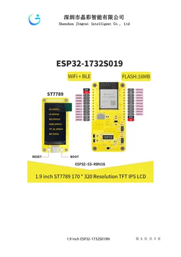

# ESP32-1732S019

**Guition** · ESP32

Revision: Not identified  
Coverage: Pinout image collected

[Browse all manufacturers](../../../../BROWSE.md) · [Devices & IoT](../../../../DEVICES.md) · [Open in the browser guide](https://valleytech-black-wire-guide.pages.dev/?board=guition-cyd-esp32-1732s019)

Device category: **Displays & HMI**

## Pinout reference - PDF page 5

**pinout image** · Reviewed source · PNG

[Open original reference](../../../../library/media/8b0987d1e1254c7ac1afbb3a9e7d60360f8668a52cff427cb18cd8fb0d7ab527.png)

**Credit and rights:** Not established; source attribution retained. Source/manufacturer: Guition.

[Source 1](https://www.guition.com/icms/upload/fb081940d6fc11f09850077a33e1404f/FTPData/UEditor/file/2026121/1768961091171/ESP32-1732S019 Specifications-EN.pdf) · [Source 2](https://www.guition.com/-download)

Manufacturer-hosted board reference; select and review physical pinout pages before inclusion. Original PDF page 5 rendered at 220 dpi; no labels changed.

Image revision: Not identified

SHA-256: `8b0987d1e1254c7ac1afbb3a9e7d60360f8668a52cff427cb18cd8fb0d7ab527`

## Manufacturer reference PDF

**original reference PDF** · Reviewed source · PDF

[Open original reference](../../../../library/media/2cf388e25ce03a69940140721e1484d1a524649348a685aae830570b15cd9d02.pdf)

**Credit and rights:** Not established; source attribution retained. Source/manufacturer: Guition.

[Source 1](https://www.guition.com/icms/upload/fb081940d6fc11f09850077a33e1404f/FTPData/UEditor/file/2026121/1768961091171/ESP32-1732S019 Specifications-EN.pdf) · [Source 2](https://www.guition.com/-download)

Manufacturer-hosted board reference; select and review physical pinout pages before inclusion.

Image revision: Not identified

SHA-256: `2cf388e25ce03a69940140721e1484d1a524649348a685aae830570b15cd9d02`

Pin assignments have not been independently electrically verified. Check board revision before wiring.
