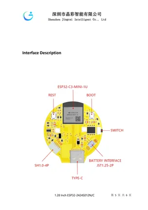

# ESP32-2424S012

**Guition** · ESP32

Revision: Not identified  
Coverage: Board labels only; pinout needed

[Browse all manufacturers](../../../../BROWSE.md) · [Desktop app](https://github.com/valleytechsolutions/black-wire-desktop)

## Board layout labels - PDF page 5

**board labeling image** · Reviewed source · PNG

[Open original reference](../../../../library/media/5ac82889b87304adc9340a64a77458f11295966d8884e81af735ee5edb7b20e6.png)

**Credit and rights:** Not established; source attribution retained. Source/manufacturer: Guition.

[Source 1](https://www.guition.com/icms/upload/fb081940d6fc11f09850077a33e1404f/FTPData/UEditor/file/2026121/1768961091229/ESP32-2424S012 Specifications-EN.pdf) · [Source 2](https://www.guition.com/-download)

Manufacturer-hosted board reference; select and review physical pinout pages before inclusion. Original PDF page 5 rendered at 220 dpi; no labels changed. This labels board components/connectors and is not a pin-by-pin signal map.

SHA-256: `5ac82889b87304adc9340a64a77458f11295966d8884e81af735ee5edb7b20e6`

## Manufacturer reference PDF

**original reference PDF** · Reviewed source · PDF

[Open original reference](../../../../library/media/d70f3d75a46115c7e0cedfccf6f00d5d64c5624ba2108b3dc928fc43ac20b5ca.pdf)

**Credit and rights:** Not established; source attribution retained. Source/manufacturer: Guition.

[Source 1](https://www.guition.com/icms/upload/fb081940d6fc11f09850077a33e1404f/FTPData/UEditor/file/2026121/1768961091229/ESP32-2424S012 Specifications-EN.pdf) · [Source 2](https://www.guition.com/-download)

Manufacturer-hosted board reference; select and review physical pinout pages before inclusion.

SHA-256: `d70f3d75a46115c7e0cedfccf6f00d5d64c5624ba2108b3dc928fc43ac20b5ca`

Pin assignments have not been independently electrically verified. Check board revision before wiring.
