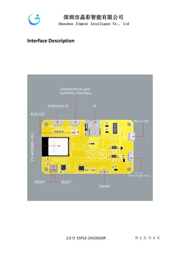

# ESP32-2432S028

**Guition** · ESP32

Revision: Not identified  
Coverage: Board labels only; pinout needed

[Browse all manufacturers](../../../../BROWSE.md) · [Desktop app](https://github.com/valleytechsolutions/black-wire-desktop)

## Board layout labels - PDF page 5

**board labeling image** · Reviewed source · PNG

[Open original reference](../../../../library/media/b6edae2270f6ecb5eb41e9acc8cd9cd94cb145d74151650e24728cf6b8287eeb.png)

**Credit and rights:** Not established; source attribution retained. Source/manufacturer: Guition.

[Source 1](https://www.guition.com/icms/upload/fb081940d6fc11f09850077a33e1404f/FTPData/UEditor/file/2026121/1768961091633/ESP32-2432S028 Specifications-EN.pdf) · [Source 2](https://www.guition.com/-download)

Manufacturer-hosted board reference; select and review physical pinout pages before inclusion. Original PDF page 5 rendered at 220 dpi; no labels changed. This labels board components/connectors and is not a pin-by-pin signal map.

SHA-256: `b6edae2270f6ecb5eb41e9acc8cd9cd94cb145d74151650e24728cf6b8287eeb`

## Manufacturer reference PDF

**original reference PDF** · Reviewed source · PDF

[Open original reference](../../../../library/media/e3fb0ac1aadea6cf589c6bbe1a45d411879331d384e47c5361a471a6997911ab.pdf)

**Credit and rights:** Not established; source attribution retained. Source/manufacturer: Guition.

[Source 1](https://www.guition.com/icms/upload/fb081940d6fc11f09850077a33e1404f/FTPData/UEditor/file/2026121/1768961091633/ESP32-2432S028 Specifications-EN.pdf) · [Source 2](https://www.guition.com/-download)

Manufacturer-hosted board reference; select and review physical pinout pages before inclusion.

SHA-256: `e3fb0ac1aadea6cf589c6bbe1a45d411879331d384e47c5361a471a6997911ab`

Pin assignments have not been independently electrically verified. Check board revision before wiring.
