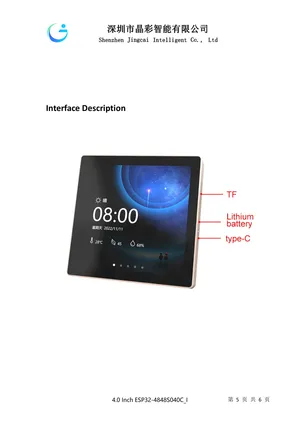

# ESP32-4848S040

**Guition** · ESP32

Revision: Not identified  
Coverage: Board labels only; pinout needed

[Browse all manufacturers](../../../../BROWSE.md) · [Devices & IoT](../../../../DEVICES.md) · [Open in the browser guide](https://valleytech-black-wire-guide.pages.dev/?board=guition-cyd-esp32-4848s040)

Device category: **Displays & HMI**

## Board layout labels - PDF page 5

**board labeling image** · Reviewed source · PNG

[Open original reference](../../../../library/media/4f348035031ea2fbf3aa8e094edcb1546e8d3d0c89ba80f3e62ae3c913cd29fd.png)

**Credit and rights:** Not established; source attribution retained. Source/manufacturer: Guition.

[Source 1](https://www.guition.com/icms/upload/fb081940d6fc11f09850077a33e1404f/FTPData/UEditor/file/2026121/1768961092477/ESP32-4848S040 Specifications-EN.pdf) · [Source 2](https://www.guition.com/-download)

Manufacturer-hosted board reference; select and review physical pinout pages before inclusion. Original PDF page 5 rendered at 220 dpi; no labels changed. This labels board components/connectors and is not a pin-by-pin signal map. Source has inconsistent model text: file/body S040, cover S043. Exact revision needs confirmation.

Image revision: Not identified

SHA-256: `4f348035031ea2fbf3aa8e094edcb1546e8d3d0c89ba80f3e62ae3c913cd29fd`

## Manufacturer reference PDF

**original reference PDF** · Reviewed source · PDF

[Open original reference](../../../../library/media/b482c895047db6ee531ea2fb0d14c9b229421e23d33f4142a450193efbad664d.pdf)

**Credit and rights:** Not established; source attribution retained. Source/manufacturer: Guition.

[Source 1](https://www.guition.com/icms/upload/fb081940d6fc11f09850077a33e1404f/FTPData/UEditor/file/2026121/1768961092477/ESP32-4848S040 Specifications-EN.pdf) · [Source 2](https://www.guition.com/-download)

Manufacturer-hosted board reference; select and review physical pinout pages before inclusion.

Image revision: Not identified

SHA-256: `b482c895047db6ee531ea2fb0d14c9b229421e23d33f4142a450193efbad664d`

Pin assignments have not been independently electrically verified. Check board revision before wiring.
