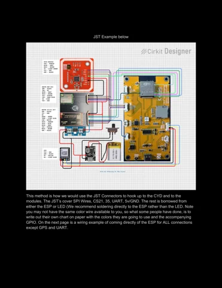
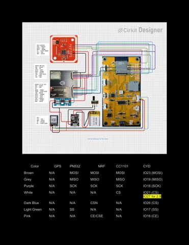
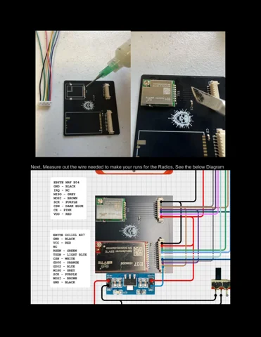
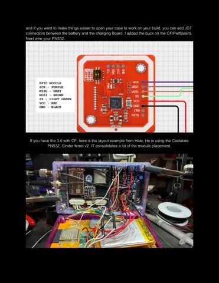
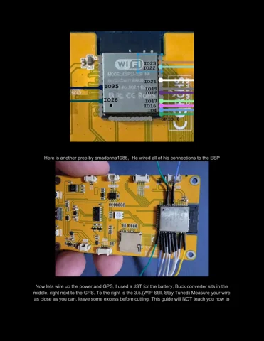

# HaleHound CYD 2.8 SPI-exposed build

**HaleHound** · ESP32

Revision: Build guide v1.4.1 (2026-06-13); QDtech E32R28T base; kit PCB revision not established

Coverage: Partial physical pinout reference; independent completeness review pending

[Browse all manufacturers](../../../../BROWSE.md) · [Devices & IoT](../../../../DEVICES.md) · [Open in the browser guide](https://valleytech-black-wire-guide.pages.dev/?board=halehound-cyd-spi-28)

Device category: **Radios & GNSS**

Source identity and visual type reviewed; electrical limits and pin assignments have not been independently bench-verified. Match the exact PCB, connector orientation and interface mode. Build-guide v1.4.1 reference, not a complete device pinout or confirmed specification for every kit. Original non-SPI CYD and SPI-exposed QDtech CYD assignments differ. Page 8 CS wording and page 9 original-CYD overrides must be read together. GPS TX/RX labels are ambiguous; verify signal direction before wiring. The guide calls an AMS1117 regulator a buck converter; these power statements are not imported as verified Power Desk ratings.

Architecture: **Xtensa**

## Datasheets and original documentation

Board datasheet: **not yet recorded**. Visual reference: **available**.

[Original publisher / manufacturer documentation](https://halehound.com/products/diy-halehound-kit)

- **hardware-guide / board**: [HaleHound CYD Build Guide v1.4.1 — original 18-page PDF](https://halehound.com/cdn/shop/t/4/assets/HaleHound-CYD-Build-Guide-v141.pdf?v=157209395051550384641781748372) · [saved document](../../../../library/media/af634b906496f82d5d545993a9d9fd1aff56658f019e882d413d38678ee3cdc2.pdf)

Source identity and visual type reviewed; electrical limits and pin assignments have not been independently bench-verified. Match the exact PCB, connector orientation and interface mode. Build-guide v1.4.1 reference, not a complete device pinout or confirmed specification for every kit. Original non-SPI CYD and SPI-exposed QDtech CYD assignments differ. Page 8 CS wording and page 9 original-CYD overrides must be read together. GPS TX/RX labels are ambiguous; verify signal direction before wiring. The guide calls an AMS1117 regulator a buck converter; these power statements are not imported as verified Power Desk ratings.

[Documentation coverage and remaining gaps](../../../../DOCUMENTATION.md)

## Specifications and hardware documentation

- [Original hardware documentation](https://halehound.com/products/diy-halehound-kit)

## HaleHound CYD Build Guide v1.4.1 — original 18-page PDF

**original reference PDF** · Source image / document inspected; independent electrical review pending · PDF

[Open original reference](../../../../library/media/af634b906496f82d5d545993a9d9fd1aff56658f019e882d413d38678ee3cdc2.pdf)

**Credit and rights:** HaleHound / Bkbroiler and original diagram, photograph and hardware contributors credited in Build Guide v1.4.1. Asset-specific redistribution and print rights are not established; Black Wire's editorial license does not relicense this artwork.. Source/manufacturer: HaleHound.

[Source 1](https://halehound.com/cdn/shop/t/4/assets/HaleHound-CYD-Build-Guide-v141.pdf?v=157209395051550384641781748372) · [Source 2](https://halehound.com/products/diy-halehound-kit)

Source identity and visual type reviewed; electrical limits and pin assignments have not been independently bench-verified. Match the exact PCB, connector orientation and interface mode. Build-guide v1.4.1 reference, not a complete device pinout or confirmed specification for every kit. Original non-SPI CYD and SPI-exposed QDtech CYD assignments differ. Page 8 CS wording and page 9 original-CYD overrides must be read together. GPS TX/RX labels are ambiguous; verify signal direction before wiring. The guide calls an AMS1117 regulator a buck converter; these power statements are not imported as verified Power Desk ratings.

Image revision: Build guide v1.4.1 (2026-06-13); QDtech E32R28T base; kit PCB revision not established

SHA-256: `af634b906496f82d5d545993a9d9fd1aff56658f019e882d413d38678ee3cdc2`

## HaleHound v1.4.1 — page 3 — original and SPI CYD identification

**board labeling image** · Source image / document inspected; independent electrical review pending · PNG

[Open original reference](../../../../library/media/8c730a5a3bc9c17745543c7f43f834218528696074f18997454e8ab393f35368.png)

**Credit and rights:** HaleHound / Bkbroiler and original diagram, photograph and hardware contributors credited in Build Guide v1.4.1. Asset-specific redistribution and print rights are not established; Black Wire's editorial license does not relicense this artwork.. Source/manufacturer: HaleHound.

[Source 1](https://halehound.com/cdn/shop/t/4/assets/HaleHound-CYD-Build-Guide-v141.pdf?v=157209395051550384641781748372) · [Source 2](https://halehound.com/products/diy-halehound-kit)

Source identity and visual type reviewed; electrical limits and pin assignments have not been independently bench-verified. Match the exact PCB, connector orientation and interface mode. Build-guide v1.4.1 reference, not a complete device pinout or confirmed specification for every kit. Original non-SPI CYD and SPI-exposed QDtech CYD assignments differ. Page 8 CS wording and page 9 original-CYD overrides must be read together. GPS TX/RX labels are ambiguous; verify signal direction before wiring. The guide calls an AMS1117 regulator a buck converter; these power statements are not imported as verified Power Desk ratings.

Image revision: Build guide v1.4.1 (2026-06-13); QDtech E32R28T base; kit PCB revision not established

SHA-256: `8c730a5a3bc9c17745543c7f43f834218528696074f18997454e8ab393f35368`

## HaleHound v1.4.1 — page 6 — SPI CYD JST assembly wiring

**wiring reference** · Source image / document inspected; independent electrical review pending · PNG

[Open original reference](../../../../library/media/17a0d10eab897d422a40dea08fff0ed12bb0a3e92effe5b1b4b3df93949fa129.png)

**Credit and rights:** HaleHound / Bkbroiler and original diagram, photograph and hardware contributors credited in Build Guide v1.4.1. Asset-specific redistribution and print rights are not established; Black Wire's editorial license does not relicense this artwork.. Source/manufacturer: HaleHound.

[Source 1](https://halehound.com/cdn/shop/t/4/assets/HaleHound-CYD-Build-Guide-v141.pdf?v=157209395051550384641781748372) · [Source 2](https://halehound.com/products/diy-halehound-kit)

Source identity and visual type reviewed; electrical limits and pin assignments have not been independently bench-verified. Match the exact PCB, connector orientation and interface mode. Build-guide v1.4.1 reference, not a complete device pinout or confirmed specification for every kit. Original non-SPI CYD and SPI-exposed QDtech CYD assignments differ. Page 8 CS wording and page 9 original-CYD overrides must be read together. GPS TX/RX labels are ambiguous; verify signal direction before wiring. The guide calls an AMS1117 regulator a buck converter; these power statements are not imported as verified Power Desk ratings.

Image revision: Build guide v1.4.1 (2026-06-13); QDtech E32R28T base; kit PCB revision not established

SHA-256: `17a0d10eab897d422a40dea08fff0ed12bb0a3e92effe5b1b4b3df93949fa129`

## HaleHound v1.4.1 — page 8 — direct wiring and signal table (continues on page 9)

**wiring reference** · Source image / document inspected; independent electrical review pending · PNG

[Open original reference](../../../../library/media/de597fc7bce6de73602881d699f9154f1ab0d79bf94b294f325b792b173c4f83.png)

**Credit and rights:** HaleHound / Bkbroiler and original diagram, photograph and hardware contributors credited in Build Guide v1.4.1. Asset-specific redistribution and print rights are not established; Black Wire's editorial license does not relicense this artwork.. Source/manufacturer: HaleHound.

[Source 1](https://halehound.com/cdn/shop/t/4/assets/HaleHound-CYD-Build-Guide-v141.pdf?v=157209395051550384641781748372) · [Source 2](https://halehound.com/products/diy-halehound-kit)

Source identity and visual type reviewed; electrical limits and pin assignments have not been independently bench-verified. Match the exact PCB, connector orientation and interface mode. Build-guide v1.4.1 reference, not a complete device pinout or confirmed specification for every kit. Original non-SPI CYD and SPI-exposed QDtech CYD assignments differ. Page 8 CS wording and page 9 original-CYD overrides must be read together. GPS TX/RX labels are ambiguous; verify signal direction before wiring. The guide calls an AMS1117 regulator a buck converter; these power statements are not imported as verified Power Desk ratings.

Image revision: Build guide v1.4.1 (2026-06-13); QDtech E32R28T base; kit PCB revision not established

SHA-256: `de597fc7bce6de73602881d699f9154f1ab0d79bf94b294f325b792b173c4f83`

## HaleHound v1.4.1 — page 9 — signal table continuation and original-CYD overrides

**pin function reference** · Source image / document inspected; independent electrical review pending · PNG

[Open original reference](../../../../library/media/2fe0c2883620ced06ab413db1ffb8d573a9200eff3883ef0111c42ce51d78128.png)

**Credit and rights:** HaleHound / Bkbroiler and original diagram, photograph and hardware contributors credited in Build Guide v1.4.1. Asset-specific redistribution and print rights are not established; Black Wire's editorial license does not relicense this artwork.. Source/manufacturer: HaleHound.

[Source 1](https://halehound.com/cdn/shop/t/4/assets/HaleHound-CYD-Build-Guide-v141.pdf?v=157209395051550384641781748372) · [Source 2](https://halehound.com/products/diy-halehound-kit)

Source identity and visual type reviewed; electrical limits and pin assignments have not been independently bench-verified. Match the exact PCB, connector orientation and interface mode. Build-guide v1.4.1 reference, not a complete device pinout or confirmed specification for every kit. Original non-SPI CYD and SPI-exposed QDtech CYD assignments differ. Page 8 CS wording and page 9 original-CYD overrides must be read together. GPS TX/RX labels are ambiguous; verify signal direction before wiring. The guide calls an AMS1117 regulator a buck converter; these power statements are not imported as verified Power Desk ratings.

Image revision: Build guide v1.4.1 (2026-06-13); QDtech E32R28T base; kit PCB revision not established

SHA-256: `2fe0c2883620ced06ab413db1ffb8d573a9200eff3883ef0111c42ce51d78128`

## HaleHound v1.4.1 — page 11 — radio module / carrier wiring

**wiring reference** · Source image / document inspected; independent electrical review pending · PNG

[Open original reference](../../../../library/media/6f91b11e56a8aedb21a88718bcfcf4b8764850556ac113951a28abe90162474f.png)

**Credit and rights:** HaleHound / Bkbroiler and original diagram, photograph and hardware contributors credited in Build Guide v1.4.1. Asset-specific redistribution and print rights are not established; Black Wire's editorial license does not relicense this artwork.. Source/manufacturer: HaleHound.

[Source 1](https://halehound.com/cdn/shop/t/4/assets/HaleHound-CYD-Build-Guide-v141.pdf?v=157209395051550384641781748372) · [Source 2](https://halehound.com/products/diy-halehound-kit)

Source identity and visual type reviewed; electrical limits and pin assignments have not been independently bench-verified. Match the exact PCB, connector orientation and interface mode. Build-guide v1.4.1 reference, not a complete device pinout or confirmed specification for every kit. Original non-SPI CYD and SPI-exposed QDtech CYD assignments differ. Page 8 CS wording and page 9 original-CYD overrides must be read together. GPS TX/RX labels are ambiguous; verify signal direction before wiring. The guide calls an AMS1117 regulator a buck converter; these power statements are not imported as verified Power Desk ratings.

Image revision: Build guide v1.4.1 (2026-06-13); QDtech E32R28T base; kit PCB revision not established

SHA-256: `6f91b11e56a8aedb21a88718bcfcf4b8764850556ac113951a28abe90162474f`

## HaleHound v1.4.1 — page 12 — PN532 wiring and 3.5-inch layout example

**wiring reference** · Source image / document inspected; independent electrical review pending · PNG

[Open original reference](../../../../library/media/ae3f1829a271f5bc38c97258afe2cab949519186384db5a2f56bb386c51411ac.png)

**Credit and rights:** HaleHound / Bkbroiler and original diagram, photograph and hardware contributors credited in Build Guide v1.4.1. Asset-specific redistribution and print rights are not established; Black Wire's editorial license does not relicense this artwork.. Source/manufacturer: HaleHound.

[Source 1](https://halehound.com/cdn/shop/t/4/assets/HaleHound-CYD-Build-Guide-v141.pdf?v=157209395051550384641781748372) · [Source 2](https://halehound.com/products/diy-halehound-kit)

Source identity and visual type reviewed; electrical limits and pin assignments have not been independently bench-verified. Match the exact PCB, connector orientation and interface mode. Build-guide v1.4.1 reference, not a complete device pinout or confirmed specification for every kit. Original non-SPI CYD and SPI-exposed QDtech CYD assignments differ. Page 8 CS wording and page 9 original-CYD overrides must be read together. GPS TX/RX labels are ambiguous; verify signal direction before wiring. The guide calls an AMS1117 regulator a buck converter; these power statements are not imported as verified Power Desk ratings.

Image revision: Build guide v1.4.1 (2026-06-13); QDtech E32R28T base; kit PCB revision not established

SHA-256: `ae3f1829a271f5bc38c97258afe2cab949519186384db5a2f56bb386c51411ac`

## HaleHound v1.4.1 — page 15 — original and SPI CYD soldering references

**wiring reference** · Source image / document inspected; independent electrical review pending · PNG

[Open original reference](../../../../library/media/f7167ad2b0f8a4291d9641fa1fd1b05f11c17df51bde14c69c24ea7f55f3be29.png)

**Credit and rights:** HaleHound / Bkbroiler and original diagram, photograph and hardware contributors credited in Build Guide v1.4.1. Asset-specific redistribution and print rights are not established; Black Wire's editorial license does not relicense this artwork.. Source/manufacturer: HaleHound.

[Source 1](https://halehound.com/cdn/shop/t/4/assets/HaleHound-CYD-Build-Guide-v141.pdf?v=157209395051550384641781748372) · [Source 2](https://halehound.com/products/diy-halehound-kit)

Source identity and visual type reviewed; electrical limits and pin assignments have not been independently bench-verified. Match the exact PCB, connector orientation and interface mode. Build-guide v1.4.1 reference, not a complete device pinout or confirmed specification for every kit. Original non-SPI CYD and SPI-exposed QDtech CYD assignments differ. Page 8 CS wording and page 9 original-CYD overrides must be read together. GPS TX/RX labels are ambiguous; verify signal direction before wiring. The guide calls an AMS1117 regulator a buck converter; these power statements are not imported as verified Power Desk ratings.

Image revision: Build guide v1.4.1 (2026-06-13); QDtech E32R28T base; kit PCB revision not established

SHA-256: `f7167ad2b0f8a4291d9641fa1fd1b05f11c17df51bde14c69c24ea7f55f3be29`

## HaleHound v1.4.1 — page 16 — partial GPIO labels on the pictured 2.8-inch PCB

**pinout image** · Source image / document inspected; independent electrical review pending · PNG

[Open original reference](../../../../library/media/e05f89ebaf852df5e45ed0aa8e4781eeed6d333f9d4fca17e1794392181f3382.png)

**Credit and rights:** HaleHound / Bkbroiler and original diagram, photograph and hardware contributors credited in Build Guide v1.4.1. Asset-specific redistribution and print rights are not established; Black Wire's editorial license does not relicense this artwork.. Source/manufacturer: HaleHound.

[Source 1](https://halehound.com/cdn/shop/t/4/assets/HaleHound-CYD-Build-Guide-v141.pdf?v=157209395051550384641781748372) · [Source 2](https://halehound.com/products/diy-halehound-kit)

Source identity and visual type reviewed; electrical limits and pin assignments have not been independently bench-verified. Match the exact PCB, connector orientation and interface mode. Build-guide v1.4.1 reference, not a complete device pinout or confirmed specification for every kit. Original non-SPI CYD and SPI-exposed QDtech CYD assignments differ. Page 8 CS wording and page 9 original-CYD overrides must be read together. GPS TX/RX labels are ambiguous; verify signal direction before wiring. The guide calls an AMS1117 regulator a buck converter; these power statements are not imported as verified Power Desk ratings.

Image revision: Build guide v1.4.1 (2026-06-13); QDtech E32R28T base; kit PCB revision not established

SHA-256: `e05f89ebaf852df5e45ed0aa8e4781eeed6d333f9d4fca17e1794392181f3382`

Pin assignments have not been independently electrically verified. Check board revision before wiring.
