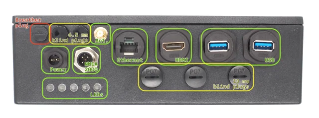
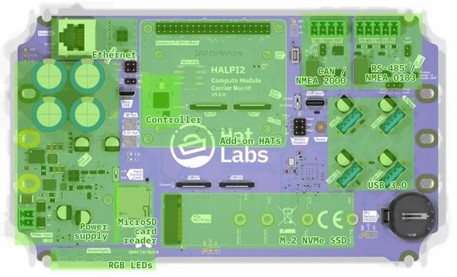
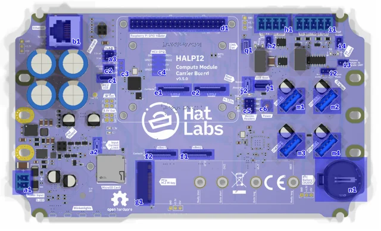
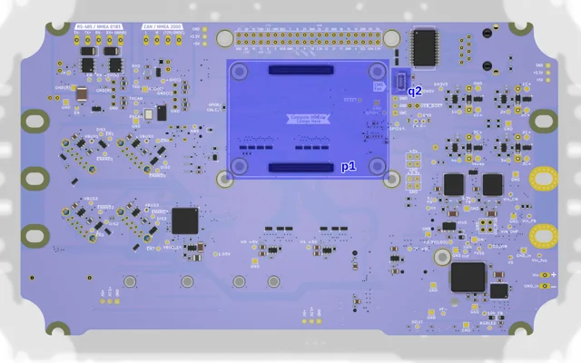

# HALPI2 marine Raspberry Pi CM5 computer

**Hat Labs** · BCM2712 / Raspberry Pi CM5

Revision: Carrier versions vary; source images include v0.5.0

Coverage: Supporting references; complete physical pinout still needed

[Browse all manufacturers](../../../../BROWSE.md) · [Devices & IoT](../../../../DEVICES.md) · [Open in the browser guide](https://valleytech-black-wire-guide.pages.dev/?board=hatlabs-halpi2)

Device category: **Controllers & instruments**

Source identity and visual scope reviewed. Pin assignments and electrical limits are not independently bench-verified. Match the exact PCB revision, connector view and populated options. Carrier connector groups and occupied GPIO functions must be checked against the hardware revision. A generic Raspberry Pi header alone does not describe this carrier.

Architecture: **ARM**

## Datasheets and original documentation

Board datasheet: **not yet recorded**. Visual reference: **available**.

[Original manufacturer / project documentation](https://docs.hatlabs.fi/halpi2/user-guide/hardware/)

- **hardware-guide / board**: [Serial, CAN, 1-Wire and GPIO interface reference](https://docs.hatlabs.fi/halpi2/user-guide/interfaces/) · online
- **hardware-guide / board**: [Hardware specification and revision constraints](https://docs.hatlabs.fi/halpi2/technical-reference/hardware/) · online

Source identity and visual scope reviewed. Pin assignments and electrical limits are not independently bench-verified. Match the exact PCB revision, connector view and populated options. Carrier connector groups and occupied GPIO functions must be checked against the hardware revision. A generic Raspberry Pi header alone does not describe this carrier.

[Documentation coverage and remaining gaps](../../../../DOCUMENTATION.md)

## HALPI2 — Front Panel Connectors and Blind Plugs

**board labeling image** · Source visual inspected; independent electrical and all-pin completeness review pending · JPG

[Open original reference](../../../../library/media/df3ce47bf6651268148ca8a91bb4343dfcaab9f5cc9e1b309a6c97e2f28ecf41.jpg)

**Credit and rights:** Hat Labs / original artwork contributors. Asset-specific redistribution and print rights are not established; Black Wire licenses do not relicense this source artwork.. Source/manufacturer: Hat Labs.

[Source 1](https://docs.hatlabs.fi/halpi2/user-guide/front-panel-connectors-all.jpg) · [Source 2](https://docs.hatlabs.fi/halpi2/user-guide/hardware/)

Source identity and visual scope reviewed. Pin assignments and electrical limits are not independently bench-verified. Match the exact PCB revision, connector view and populated options. Carrier connector groups and occupied GPIO functions must be checked against the hardware revision. A generic Raspberry Pi header alone does not describe this carrier.

Image revision: Carrier versions vary; source images include v0.5.0

SHA-256: `df3ce47bf6651268148ca8a91bb4343dfcaab9f5cc9e1b309a6c97e2f28ecf41`

## HALPI2 — Carrier Board Layout, Top-side

**board labeling image** · Source visual inspected; independent electrical and all-pin completeness review pending · JPG

[Open original reference](../../../../library/media/d2bbca6ae199f95caaf86e0e853ab10f848233486506f9cb6282e484a03395e3.jpg)

**Credit and rights:** Hat Labs / original artwork contributors. Asset-specific redistribution and print rights are not established; Black Wire licenses do not relicense this source artwork.. Source/manufacturer: Hat Labs.

[Source 1](https://docs.hatlabs.fi/halpi2/user-guide/carrier-board-top-layout.jpg) · [Source 2](https://docs.hatlabs.fi/halpi2/user-guide/hardware/)

Source identity and visual scope reviewed. Pin assignments and electrical limits are not independently bench-verified. Match the exact PCB revision, connector view and populated options. Carrier connector groups and occupied GPIO functions must be checked against the hardware revision. A generic Raspberry Pi header alone does not describe this carrier.

Image revision: Carrier versions vary; source images include v0.5.0

SHA-256: `d2bbca6ae199f95caaf86e0e853ab10f848233486506f9cb6282e484a03395e3`

## HALPI2 — Carrier Board Connectors, Top-side

**board labeling image** · Source visual inspected; independent electrical and all-pin completeness review pending · JPG

[Open original reference](../../../../library/media/d299296ddd840b6126391f8f9c65f8215769926ce86b119989a7175aea541022.jpg)

**Credit and rights:** Hat Labs / original artwork contributors. Asset-specific redistribution and print rights are not established; Black Wire licenses do not relicense this source artwork.. Source/manufacturer: Hat Labs.

[Source 1](https://docs.hatlabs.fi/halpi2/user-guide/carrier-board-top-conx.jpg) · [Source 2](https://docs.hatlabs.fi/halpi2/user-guide/hardware/)

Source identity and visual scope reviewed. Pin assignments and electrical limits are not independently bench-verified. Match the exact PCB revision, connector view and populated options. Carrier connector groups and occupied GPIO functions must be checked against the hardware revision. A generic Raspberry Pi header alone does not describe this carrier.

Image revision: Carrier versions vary; source images include v0.5.0

SHA-256: `d299296ddd840b6126391f8f9c65f8215769926ce86b119989a7175aea541022`

## HALPI2 — Carrier Board Connectors, Bottom side

**board labeling image** · Source visual inspected; independent electrical and all-pin completeness review pending · JPG

[Open original reference](../../../../library/media/2af45cfc2ca6b2a611e125903e944dfe247b06976e38c98d2fcbebe1e53feab3.jpg)

**Credit and rights:** Hat Labs / original artwork contributors. Asset-specific redistribution and print rights are not established; Black Wire licenses do not relicense this source artwork.. Source/manufacturer: Hat Labs.

[Source 1](https://docs.hatlabs.fi/halpi2/user-guide/carrier-board-bottom-conx.jpg) · [Source 2](https://docs.hatlabs.fi/halpi2/user-guide/hardware/)

Source identity and visual scope reviewed. Pin assignments and electrical limits are not independently bench-verified. Match the exact PCB revision, connector view and populated options. Carrier connector groups and occupied GPIO functions must be checked against the hardware revision. A generic Raspberry Pi header alone does not describe this carrier.

Image revision: Carrier versions vary; source images include v0.5.0

SHA-256: `2af45cfc2ca6b2a611e125903e944dfe247b06976e38c98d2fcbebe1e53feab3`

Pin assignments have not been independently electrically verified. Check board revision before wiring.
