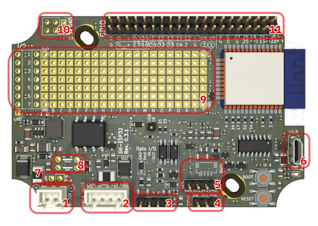
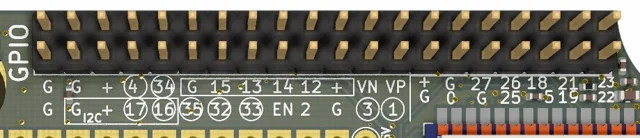

# Sailor Hat with ESP32 (SH-ESP32)

**Hat Labs** · ESP32-WROOM-32E

Revision: GPIO photo filename r0.3.1; documentation describes Rev.1 and Rev.2

Coverage: Physical source pinout available; independent completeness review pending

[Browse all manufacturers](../../../../BROWSE.md) · [Devices & IoT](../../../../DEVICES.md) · [Open in the browser guide](https://valleytech-black-wire-guide.pages.dev/?board=hatlabs-sh-esp32)

## Datasheets and original documentation

Board datasheet: **not yet recorded**. Visual reference: **available**.

[Original manufacturer / project documentation](https://docs.hatlabs.fi/sh-esp32/hardware/)

- **hardware-guide / board**: [Revision history and schematics](https://docs.hatlabs.fi/sh-esp32/revisions/) · online
- **hardware-guide / board**: [Original hardware license and project](https://docs.hatlabs.fi/sh-esp32/) · online
- **schematic / board**: [SH-ESP32-1.0.0-schema.pdf](https://docs.hatlabs.fi/sh-esp32/revisions/assets/SH-ESP32-1.0.0-schema.pdf) · online
- **schematic / board**: [SH-ESP32-2.0.3-schema.pdf](https://docs.hatlabs.fi/sh-esp32/revisions/assets/SH-ESP32-2.0.3-schema.pdf) · online

Source identity and visual scope reviewed. Pin assignments and electrical limits are not independently bench-verified. Match the exact PCB revision, connector view and populated options. Circled GPIO labels require solder-jumper changes; they are not all connected by default. The manufacturer documents different power/CAN connectors between Rev.1 and Rev.2. Use the exact revision schematic.

[Documentation coverage and remaining gaps](../../../../DOCUMENTATION.md)

## SH-ESP32 — revision-specific connector groups

**board labeling image** · Source visual inspected; independent electrical and all-pin completeness review pending · JPG

[Open original reference](../../../../library/media/6407f578078dd23c36690bdbe3c48fce918428e3e932bb412c0f13887b108ec6.jpg)

**Credit and rights:** Hat Labs / SH-ESP32 contributors. Hardware licensed CC BY-SA 4.0 according to the original project; retain attribution and ShareAlike terms. https://creativecommons.org/licenses/by-sa/4.0/. Source/manufacturer: Hat Labs.

[Source 1](https://docs.hatlabs.fi/sh-esp32/hardware/assets/sh-esp32_r0.3.1_top_conx_annotated.jpg) · [Source 2](https://docs.hatlabs.fi/sh-esp32/hardware/)

Source identity and visual scope reviewed. Pin assignments and electrical limits are not independently bench-verified. Match the exact PCB revision, connector view and populated options. Circled GPIO labels require solder-jumper changes; they are not all connected by default. The manufacturer documents different power/CAN connectors between Rev.1 and Rev.2. Use the exact revision schematic.

Image revision: GPIO photo filename r0.3.1; documentation describes Rev.1 and Rev.2

SHA-256: `6407f578078dd23c36690bdbe3c48fce918428e3e932bb412c0f13887b108ec6`

## SH-ESP32 — GPIO header labels; circled signals require jumpers

**pinout image** · Source visual inspected; independent electrical and all-pin completeness review pending · JPG

[Open original reference](../../../../library/media/ae9dae79583efa908bb8a9cae01d908302b0bb1502cf9da76b50d3da5abae494.jpg)

**Credit and rights:** Hat Labs / SH-ESP32 contributors. Hardware licensed CC BY-SA 4.0 according to the original project; retain attribution and ShareAlike terms. https://creativecommons.org/licenses/by-sa/4.0/. Source/manufacturer: Hat Labs.

[Source 1](https://docs.hatlabs.fi/sh-esp32/hardware/assets/sh-esp32_r0.3.1_gpio.jpg) · [Source 2](https://docs.hatlabs.fi/sh-esp32/hardware/)

Source identity and visual scope reviewed. Pin assignments and electrical limits are not independently bench-verified. Match the exact PCB revision, connector view and populated options. Circled GPIO labels require solder-jumper changes; they are not all connected by default. The manufacturer documents different power/CAN connectors between Rev.1 and Rev.2. Use the exact revision schematic.

Image revision: GPIO photo filename r0.3.1; documentation describes Rev.1 and Rev.2

SHA-256: `ae9dae79583efa908bb8a9cae01d908302b0bb1502cf9da76b50d3da5abae494`

Pin assignments have not been independently electrically verified. Check board revision before wiring.
