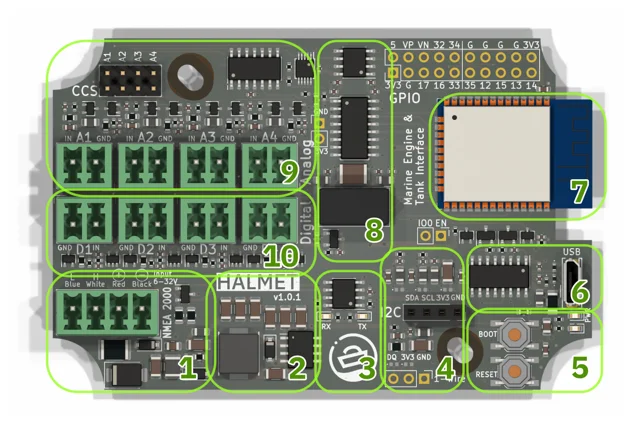
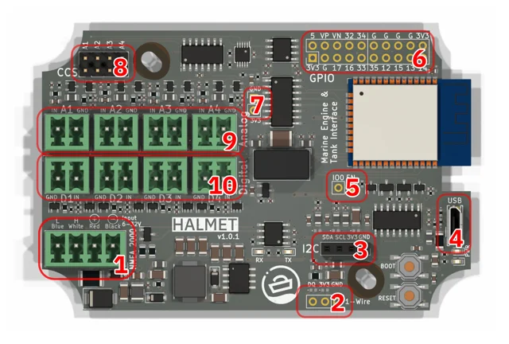
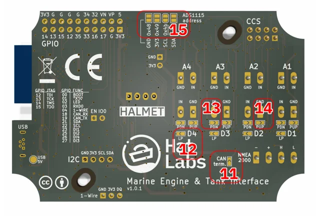

# HALMET marine engine and tank interface

**Hat Labs** · ESP32

Revision: Source board silkscreen v1.0.1

Coverage: Supporting references; complete physical pinout still needed

[Browse all manufacturers](../../../../BROWSE.md) · [Devices & IoT](../../../../DEVICES.md) · [Open in the browser guide](https://valleytech-black-wire-guide.pages.dev/?board=hatlabs-halmet)

Device category: **Controllers & instruments**

Source identity and visual scope reviewed. Pin assignments and electrical limits are not independently bench-verified. Match the exact PCB revision, connector view and populated options. Isolated analog/digital/CAN inputs and ESP32 GPIO are different electrical domains. Terminal group labels alone do not establish every pin function.

## Datasheets and original documentation

Board datasheet: **not yet recorded**. Visual reference: **available**.

[Original manufacturer / project documentation](https://docs.hatlabs.fi/halmet/hardware/)

- **hardware-guide / board**: [Manufacturer GPIO, connector and electrical documentation](https://docs.hatlabs.fi/halmet/hardware/) · online

Source identity and visual scope reviewed. Pin assignments and electrical limits are not independently bench-verified. Match the exact PCB revision, connector view and populated options. Isolated analog/digital/CAN inputs and ESP32 GPIO are different electrical domains. Terminal group labels alone do not establish every pin function.

[Documentation coverage and remaining gaps](../../../../DOCUMENTATION.md)

## HALMET — functional groups

**board labeling image** · Source visual inspected; independent electrical and all-pin completeness review pending · JPG

[Open original reference](../../../../library/media/2d7de58d140116c5e0303514a0474dad933c550190e44713678f59ca2cd8eff9.jpg)

**Credit and rights:** Hat Labs / original artwork contributors. Asset-specific redistribution and print rights are not established; Black Wire licenses do not relicense this source artwork.. Source/manufacturer: Hat Labs.

[Source 1](https://docs.hatlabs.fi/halmet/hardware/HALMET-func.jpg) · [Source 2](https://docs.hatlabs.fi/halmet/hardware/)

Source identity and visual scope reviewed. Pin assignments and electrical limits are not independently bench-verified. Match the exact PCB revision, connector view and populated options. Isolated analog/digital/CAN inputs and ESP32 GPIO are different electrical domains. Terminal group labels alone do not establish every pin function.

Image revision: Source board silkscreen v1.0.1

SHA-256: `2d7de58d140116c5e0303514a0474dad933c550190e44713678f59ca2cd8eff9`

## HALMET — top-side connector labels

**board labeling image** · Source visual inspected; independent electrical and all-pin completeness review pending · JPG

[Open original reference](../../../../library/media/3947471ddf9e9cfc543cfffe364b4ca8f3311a4f28c06ebd3dea14358b74d035.jpg)

**Credit and rights:** Hat Labs / original artwork contributors. Asset-specific redistribution and print rights are not established; Black Wire licenses do not relicense this source artwork.. Source/manufacturer: Hat Labs.

[Source 1](https://docs.hatlabs.fi/halmet/hardware/HALMET-conx-top.jpg) · [Source 2](https://docs.hatlabs.fi/halmet/hardware/)

Source identity and visual scope reviewed. Pin assignments and electrical limits are not independently bench-verified. Match the exact PCB revision, connector view and populated options. Isolated analog/digital/CAN inputs and ESP32 GPIO are different electrical domains. Terminal group labels alone do not establish every pin function.

Image revision: Source board silkscreen v1.0.1

SHA-256: `3947471ddf9e9cfc543cfffe364b4ca8f3311a4f28c06ebd3dea14358b74d035`

## HALMET — bottom-side GPIO and connector labels

**board labeling image** · Source visual inspected; independent electrical and all-pin completeness review pending · JPG

[Open original reference](../../../../library/media/865cb48aebb943d1a7eaa3bea314738f0f045fb0e62fd8a64cacb6fd6523ecb6.jpg)

**Credit and rights:** Hat Labs / original artwork contributors. Asset-specific redistribution and print rights are not established; Black Wire licenses do not relicense this source artwork.. Source/manufacturer: Hat Labs.

[Source 1](https://docs.hatlabs.fi/halmet/hardware/HALMET-conx-bottom.jpg) · [Source 2](https://docs.hatlabs.fi/halmet/hardware/)

Source identity and visual scope reviewed. Pin assignments and electrical limits are not independently bench-verified. Match the exact PCB revision, connector view and populated options. Isolated analog/digital/CAN inputs and ESP32 GPIO are different electrical domains. Terminal group labels alone do not establish every pin function.

Image revision: Source board silkscreen v1.0.1

SHA-256: `865cb48aebb943d1a7eaa3bea314738f0f045fb0e62fd8a64cacb6fd6523ecb6`

Pin assignments have not been independently electrically verified. Check board revision before wiring.
