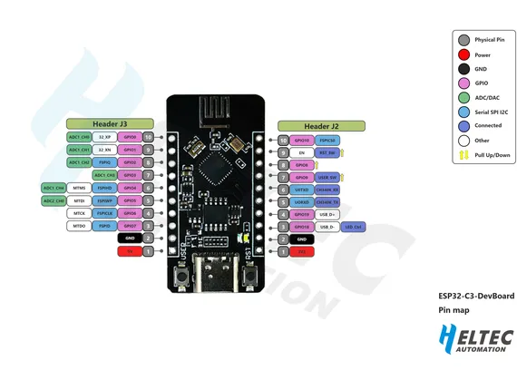
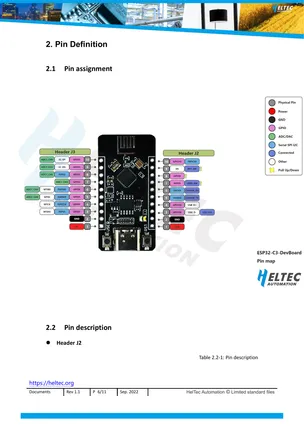

# ESP32-C3 DevBoard

**Heltec** · ESP32-C3

Revision: Multiple source/revision records; see individual assets  
Coverage: Pinout image collected

[Browse all manufacturers](../../../../BROWSE.md) · [Desktop app](https://github.com/valleytechsolutions/black-wire-desktop)

## Board pin reference - ESP32 C3_DevBoard

**pinout image** · Reviewed source · PNG

[Open original reference](../../../../library/media/027b4110ffb3a6db08c22e10fa5fee8c9bda0dbe47b03f915a6512eb83d48c38.png)

**Credit and rights:** Not established; source attribution retained. Source/manufacturer: Heltec.

[Source 1](https://resource.heltec.cn/download/ESP32-C3_DevBoard/ESP32%20C3_DevBoard.png) · [Source 2](https://resource.heltec.cn/download/ESP32-C3_DevBoard)

Original manufacturer resource filename: ESP32 C3_DevBoard.png. Filename and printed revision must be matched to the board.

SHA-256: `027b4110ffb3a6db08c22e10fa5fee8c9bda0dbe47b03f915a6512eb83d48c38`

## Pin assignment - manual page 6

**pinout image** · Reviewed source · PNG

[Open original reference](../../../../library/media/20b90c82306c688921cceaf89261286f99e39233c403f8cac69536f3112658d8.png)

**Credit and rights:** Not established; source attribution retained. Source/manufacturer: Heltec.

[Source 1](https://resource.heltec.cn/download/ESP32-C3_DevBoard/ESP32-C3_DevBoard(Rev1.1).pdf) · [Source 2](https://resource.heltec.cn/download/ESP32-C3_DevBoard)

Original manufacturer resource filename: ESP32-C3_DevBoard(Rev1.1).pdf. Filename and printed revision must be matched to the board. Original manual page 6 rendered at 220 dpi.

SHA-256: `20b90c82306c688921cceaf89261286f99e39233c403f8cac69536f3112658d8`

## Board pin reference - ESP32-C3_DevBoard(Rev1.1)

**original reference PDF** · Reviewed source · PDF

[Open original reference](../../../../library/media/3b82d212cceab01a48cf02c9f690f7622976aa6687c0911a41ff41594e753d7c.pdf)

**Credit and rights:** Not established; source attribution retained. Source/manufacturer: Heltec.

[Source 1](https://resource.heltec.cn/download/ESP32-C3_DevBoard/ESP32-C3_DevBoard(Rev1.1).pdf) · [Source 2](https://resource.heltec.cn/download/ESP32-C3_DevBoard)

Original manufacturer resource filename: ESP32-C3_DevBoard(Rev1.1).pdf. Filename and printed revision must be matched to the board.

SHA-256: `3b82d212cceab01a48cf02c9f690f7622976aa6687c0911a41ff41594e753d7c`

Pin assignments have not been independently electrically verified. Check board revision before wiring.
