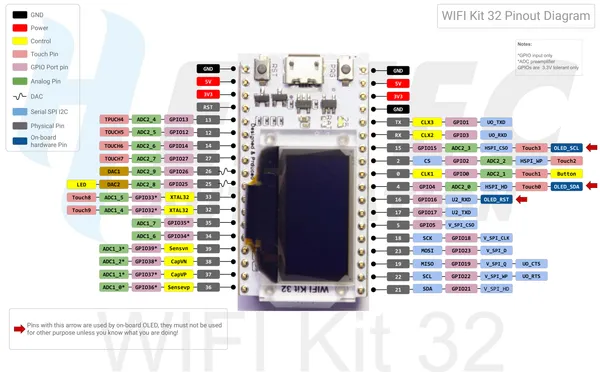

# WiFi Kit 32 V1

**Heltec** · ESP32 original

Revision: WIFI Kit 32_pinoutDiagram_V1.pdf  
Coverage: Pinout image collected

[Browse all manufacturers](../../../../BROWSE.md) · [Desktop app](https://github.com/valleytechsolutions/black-wire-desktop)

## Pinout reference - PDF page 1

**pinout image** · Reviewed source · PNG

[Open original reference](../../../../library/media/26a785380963242d1e7c072d82c2a2a38e9fcf2ed0c2a86fff7de554076dfb42.png)

**Credit and rights:** Not established; source attribution retained. Source/manufacturer: Heltec.

[Source 1](https://resource.heltec.cn/download/WiFi_Kit_32/WIFI%20Kit%2032_pinoutDiagram_V1.pdf) · [Source 2](https://resource.heltec.cn/download/WiFi_Kit_32)

Original manufacturer resource filename: WIFI Kit 32_pinoutDiagram_V1.pdf. Filename and printed revision must be matched to the board. Original PDF page 1 rendered at 220 dpi; no labels changed.

SHA-256: `26a785380963242d1e7c072d82c2a2a38e9fcf2ed0c2a86fff7de554076dfb42`

## Board pin reference - WIFI Kit 32_pinoutDiagram_V1

**original reference PDF** · Reviewed source · PDF

[Open original reference](../../../../library/media/1027376d875f06640e53916c5a9ed6fef63914445e1cdda8f7f0ed06edc4ae99.pdf)

**Credit and rights:** Not established; source attribution retained. Source/manufacturer: Heltec.

[Source 1](https://resource.heltec.cn/download/WiFi_Kit_32/WIFI%20Kit%2032_pinoutDiagram_V1.pdf) · [Source 2](https://resource.heltec.cn/download/WiFi_Kit_32)

Original manufacturer resource filename: WIFI Kit 32_pinoutDiagram_V1.pdf. Filename and printed revision must be matched to the board.

SHA-256: `1027376d875f06640e53916c5a9ed6fef63914445e1cdda8f7f0ed06edc4ae99`

Pin assignments have not been independently electrically verified. Check board revision before wiring.
