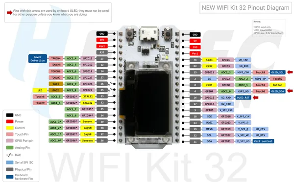

# WiFi Kit 32 V2.1

**Heltec** · ESP32 original

Revision: WIFI_Kit_32_pinoutDiagram_V2.1.pdf  
Coverage: Pinout image collected

[Browse all manufacturers](../../../../BROWSE.md) · [Desktop app](https://github.com/valleytechsolutions/black-wire-desktop)

## Pinout reference - PDF page 1

**pinout image** · Reviewed source · PNG

[Open original reference](../../../../library/media/ef89799a178f03b05bc6e6a1de4eb23ea76285b8ea534e9f9130a575c8817b31.png)

**Credit and rights:** Not established; source attribution retained. Source/manufacturer: Heltec.

[Source 1](https://resource.heltec.cn/download/WiFi_Kit_32/WIFI_Kit_32_pinoutDiagram_V2.1.pdf) · [Source 2](https://resource.heltec.cn/download/WiFi_Kit_32)

Original manufacturer resource filename: WIFI_Kit_32_pinoutDiagram_V2.1.pdf. Filename and printed revision must be matched to the board. Original PDF page 1 rendered at 220 dpi; no labels changed.

SHA-256: `ef89799a178f03b05bc6e6a1de4eb23ea76285b8ea534e9f9130a575c8817b31`

## Board pin reference - WIFI_Kit_32_pinoutDiagram_V2.1

**original reference PDF** · Reviewed source · PDF

[Open original reference](../../../../library/media/ebb3356bbac9c39601c12fbad8bd862057f63a68a804449d02fee049ed12d432.pdf)

**Credit and rights:** Not established; source attribution retained. Source/manufacturer: Heltec.

[Source 1](https://resource.heltec.cn/download/WiFi_Kit_32/WIFI_Kit_32_pinoutDiagram_V2.1.pdf) · [Source 2](https://resource.heltec.cn/download/WiFi_Kit_32)

Original manufacturer resource filename: WIFI_Kit_32_pinoutDiagram_V2.1.pdf. Filename and printed revision must be matched to the board.

SHA-256: `ebb3356bbac9c39601c12fbad8bd862057f63a68a804449d02fee049ed12d432`

Pin assignments have not been independently electrically verified. Check board revision before wiring.
