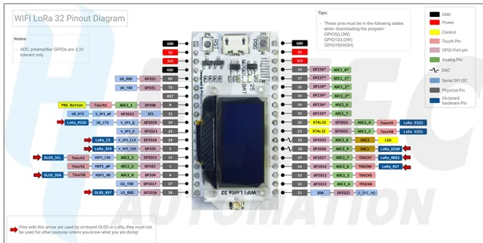

# WiFi LoRa 32 V1

**Heltec** · ESP32 original

Revision: WIFI_LoRa_32_V1.pdf  
Coverage: Pinout image collected

[Browse all manufacturers](../../../../BROWSE.md) · [Devices & IoT](../../../../DEVICES.md) · [Open in the browser guide](https://valleytech-black-wire-guide.pages.dev/?board=heltec-esp32-wifi-lora-32-v1)

Device category: **Radios & GNSS**

## Pinout reference - PDF page 1

**pinout image** · Reviewed source · PNG

[Open original reference](../../../../library/media/df6bf4f6fd7a63af8fe6c7908ad2ecfe0f37024349c039e0e4e500437051087b.png)

**Credit and rights:** Not established; source attribution retained. Source/manufacturer: Heltec.

[Source 1](https://resource.heltec.cn/download/WiFi_LoRa_32/WIFI_LoRa_32_V1.pdf) · [Source 2](https://resource.heltec.cn/download/WiFi_LoRa_32)

Original manufacturer resource filename: WIFI_LoRa_32_V1.pdf. Filename and printed revision must be matched to the board. Original PDF page 1 rendered at 220 dpi; no labels changed.

Image revision: WIFI_LoRa_32_V1.pdf

SHA-256: `df6bf4f6fd7a63af8fe6c7908ad2ecfe0f37024349c039e0e4e500437051087b`

## Board pin reference - WIFI_LoRa_32_V1

**original reference PDF** · Reviewed source · PDF

[Open original reference](../../../../library/media/22c713e745a62c2ad6f517ba7547c9147fa348f85231bb4b95d0f1f93bb8f3ab.pdf)

**Credit and rights:** Not established; source attribution retained. Source/manufacturer: Heltec.

[Source 1](https://resource.heltec.cn/download/WiFi_LoRa_32/WIFI_LoRa_32_V1.pdf) · [Source 2](https://resource.heltec.cn/download/WiFi_LoRa_32)

Original manufacturer resource filename: WIFI_LoRa_32_V1.pdf. Filename and printed revision must be matched to the board.

Image revision: WIFI_LoRa_32_V1.pdf

SHA-256: `22c713e745a62c2ad6f517ba7547c9147fa348f85231bb4b95d0f1f93bb8f3ab`

Pin assignments have not been independently electrically verified. Check board revision before wiring.
