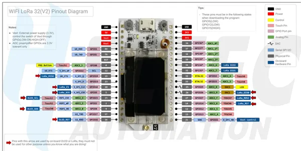

# WiFi LoRa 32 V2

**Heltec** · ESP32 original

Revision: WIFI_LoRa_32_V2.pdf  
Coverage: Pinout image collected

[Browse all manufacturers](../../../../BROWSE.md) · [Desktop app](https://github.com/valleytechsolutions/black-wire-desktop)

## Pinout reference - PDF page 1

**pinout image** · Reviewed source · PNG

[Open original reference](../../../../library/media/6127cc306c19ea93facc1f069afaa4217475d58f36e27e311a19189260ed6fde.png)

**Credit and rights:** Not established; source attribution retained. Source/manufacturer: Heltec.

[Source 1](https://resource.heltec.cn/download/WiFi_LoRa_32/WIFI_LoRa_32_V2.pdf) · [Source 2](https://resource.heltec.cn/download/WiFi_LoRa_32)

Original manufacturer resource filename: WIFI_LoRa_32_V2.pdf. Filename and printed revision must be matched to the board. Original PDF page 1 rendered at 220 dpi; no labels changed.

SHA-256: `6127cc306c19ea93facc1f069afaa4217475d58f36e27e311a19189260ed6fde`

## Board pin reference - WIFI_LoRa_32_V2

**original reference PDF** · Reviewed source · PDF

[Open original reference](../../../../library/media/b7d20e2436beee0164259dff774aecc51253b5b992f61d91667ac7e3b60c1dd6.pdf)

**Credit and rights:** Not established; source attribution retained. Source/manufacturer: Heltec.

[Source 1](https://resource.heltec.cn/download/WiFi_LoRa_32/WIFI_LoRa_32_V2.pdf) · [Source 2](https://resource.heltec.cn/download/WiFi_LoRa_32)

Original manufacturer resource filename: WIFI_LoRa_32_V2.pdf. Filename and printed revision must be matched to the board.

SHA-256: `b7d20e2436beee0164259dff774aecc51253b5b992f61d91667ac7e3b60c1dd6`

Pin assignments have not been independently electrically verified. Check board revision before wiring.
