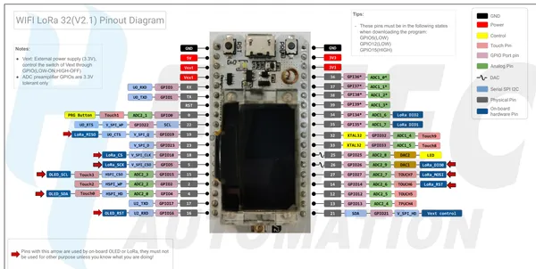

# WiFi LoRa 32 V2.1

**Heltec** · ESP32 original

Revision: WIFI_LoRa_32_V2.1.pdf  
Coverage: Pinout image collected

[Browse all manufacturers](../../../../BROWSE.md) · [Desktop app](https://github.com/valleytechsolutions/black-wire-desktop)

## Pinout reference - PDF page 1

**pinout image** · Reviewed source · PNG

[Open original reference](../../../../library/media/6f4f7e8f8c529f99dbc095182f75424402cf4cfe116a4b2a4fe0bb74b43da0a9.png)

**Credit and rights:** Not established; source attribution retained. Source/manufacturer: Heltec.

[Source 1](https://resource.heltec.cn/download/WiFi_LoRa_32/WIFI_LoRa_32_V2.1.pdf) · [Source 2](https://resource.heltec.cn/download/WiFi_LoRa_32)

Original manufacturer resource filename: WIFI_LoRa_32_V2.1.pdf. Filename and printed revision must be matched to the board. Original PDF page 1 rendered at 220 dpi; no labels changed.

SHA-256: `6f4f7e8f8c529f99dbc095182f75424402cf4cfe116a4b2a4fe0bb74b43da0a9`

## Board pin reference - WIFI_LoRa_32_V2.1

**original reference PDF** · Reviewed source · PDF

[Open original reference](../../../../library/media/488566766fd8899d628c574da016da28bd21dc8c2b4e2087c914f9b7bf2a7c21.pdf)

**Credit and rights:** Not established; source attribution retained. Source/manufacturer: Heltec.

[Source 1](https://resource.heltec.cn/download/WiFi_LoRa_32/WIFI_LoRa_32_V2.1.pdf) · [Source 2](https://resource.heltec.cn/download/WiFi_LoRa_32)

Original manufacturer resource filename: WIFI_LoRa_32_V2.1.pdf. Filename and printed revision must be matched to the board.

SHA-256: `488566766fd8899d628c574da016da28bd21dc8c2b4e2087c914f9b7bf2a7c21`

Pin assignments have not been independently electrically verified. Check board revision before wiring.
