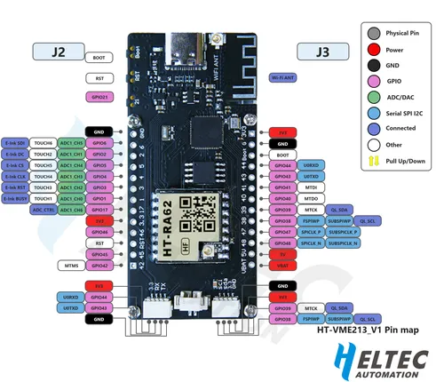

# HT-VME213

**Heltec** · ESP32-S3

Revision: HT-VME213.png  
Coverage: Pinout image collected

[Browse all manufacturers](../../../../BROWSE.md) · [Desktop app](https://github.com/valleytechsolutions/black-wire-desktop)

## Board pin reference - HT-VME213

**pinout image** · Reviewed source · PNG

[Open original reference](../../../../library/media/9ba114a80f33d8d4203692160c78a7e2390c40946c950db46f851a18581a8d8e.png)

**Credit and rights:** Not established; source attribution retained. Source/manufacturer: Heltec.

[Source 1](https://resource.heltec.cn/download/HT-VME213/HT-VME213.png) · [Source 2](https://resource.heltec.cn/download/HT-VME213)

Original manufacturer resource filename: HT-VME213.png. Filename and printed revision must be matched to the board.

SHA-256: `9ba114a80f33d8d4203692160c78a7e2390c40946c950db46f851a18581a8d8e`

Pin assignments have not been independently electrically verified. Check board revision before wiring.
