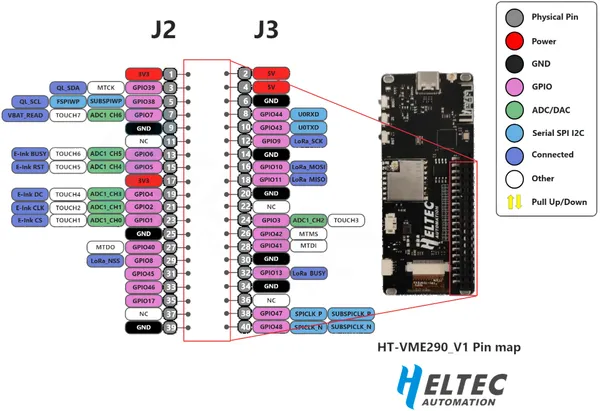

# HT-VME290

**Heltec** · ESP32-S3

Revision: HT-VME290 Pin map.png  
Coverage: Pinout image collected

[Browse all manufacturers](../../../../BROWSE.md) · [Devices & IoT](../../../../DEVICES.md) · [Open in the browser guide](https://valleytech-black-wire-guide.pages.dev/?board=heltec-esp32-ht-vme290)

Device category: **Radios & GNSS**

## Board pin reference - HT-VME290 Pin map

**pinout image** · Reviewed source · PNG

[Open original reference](../../../../library/media/fa46199bcd01c2e5a1c016ddcea37afaf8c953657db7a989c02aaac3de095233.png)

**Credit and rights:** Not established; source attribution retained. Source/manufacturer: Heltec.

[Source 1](https://resource.heltec.cn/download/HT-VME290/HT-VME290%20Pin%20map.png) · [Source 2](https://resource.heltec.cn/download/HT-VME290)

Original manufacturer resource filename: HT-VME290 Pin map.png. Filename and printed revision must be matched to the board.

Image revision: HT-VME290 Pin map.png

SHA-256: `fa46199bcd01c2e5a1c016ddcea37afaf8c953657db7a989c02aaac3de095233`

Pin assignments have not been independently electrically verified. Check board revision before wiring.
