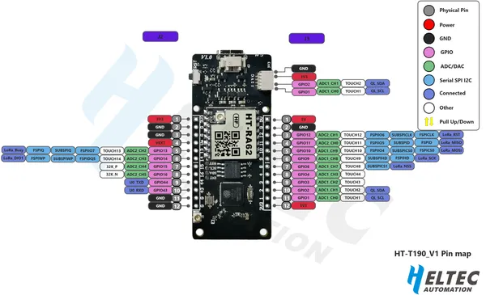
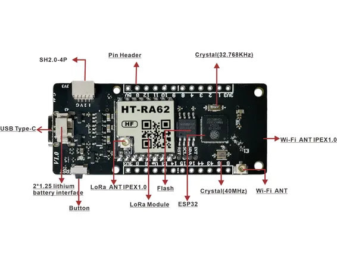

# HT-VMT190

**Heltec** · ESP32-S3

Revision: Multiple source/revision records; see individual assets  
Coverage: Pinout image collected

[Browse all manufacturers](../../../../BROWSE.md) · [Desktop app](https://github.com/valleytechsolutions/black-wire-desktop)

## Board pin reference - HT-VMT190 pin map

**pinout image** · Reviewed source · PNG

[Open original reference](../../../../library/media/a8ad40795dee25496d1f6d22c86391391bb7bae246afb262bb081f89cf181ccf.png)

**Credit and rights:** Not established; source attribution retained. Source/manufacturer: Heltec.

[Source 1](https://resource.heltec.cn/download/HT-VMT190/HT-VMT190%20pin%20map.png) · [Source 2](https://resource.heltec.cn/download/HT-VMT190)

Original manufacturer resource filename: HT-VMT190 pin map.png. Filename and printed revision must be matched to the board.

SHA-256: `a8ad40795dee25496d1f6d22c86391391bb7bae246afb262bb081f89cf181ccf`

## Board component and connector locations

**board labeling image** · Reviewed source · PNG

[Open original reference](../../../../library/media/bea25d734cfb896b88d92c1b8fb6570bcbdf5ba395ef00c9fa6709dbc20ecc08.png)

**Credit and rights:** Not established; source attribution retained. Source/manufacturer: Heltec.

[Source 1](https://resource.heltec.cn/download/HT-VMT190/T190%20hardware.png) · [Source 2](https://resource.heltec.cn/download/HT-VMT190)

Original manufacturer resource filename: T190 hardware.png. Filename and printed revision must be matched to the board.

SHA-256: `bea25d734cfb896b88d92c1b8fb6570bcbdf5ba395ef00c9fa6709dbc20ecc08`

Pin assignments have not been independently electrically verified. Check board revision before wiring.
