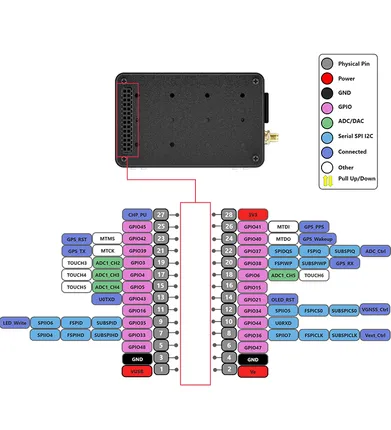

# WiFi LoRa 32 Expansion Kit

**Heltec** · ESP32-S3

Revision: PinMap.png  
Coverage: Pinout image collected

[Browse all manufacturers](../../../../BROWSE.md) · [Desktop app](https://github.com/valleytechsolutions/black-wire-desktop)

## Board pin reference - PinMap

**pinout image** · Reviewed source · PNG

[Open original reference](../../../../library/media/57be35f9d90a804d9a5efae7d6df3b89f110b848c0b63a403b130f5bb8a02a1b.png)

**Credit and rights:** Not established; source attribution retained. Source/manufacturer: Heltec.

[Source 1](https://resource.heltec.cn/download/WiFi_LoRa_32_Expansion_Kit/PinMap.png) · [Source 2](https://resource.heltec.cn/download/WiFi_LoRa_32_Expansion_Kit)

Original manufacturer resource filename: PinMap.png. Filename and printed revision must be matched to the board.

SHA-256: `57be35f9d90a804d9a5efae7d6df3b89f110b848c0b63a403b130f5bb8a02a1b`

Pin assignments have not been independently electrically verified. Check board revision before wiring.
