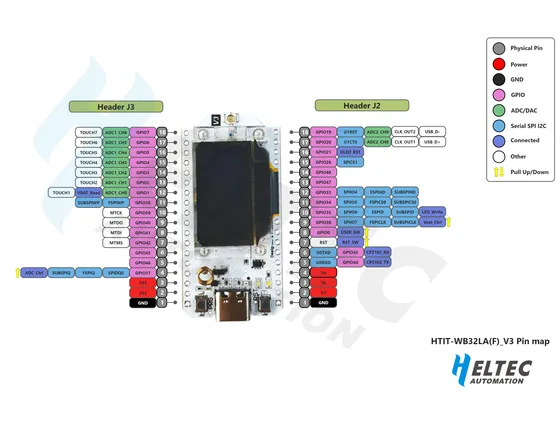

# WiFi LoRa 32 V3

**Heltec** · ESP32-S3

Revision: HTIT-WB32LA(F)_V3.png  
Coverage: Pinout image collected

[Browse all manufacturers](../../../../BROWSE.md) · [Devices & IoT](../../../../DEVICES.md) · [Open in the browser guide](https://valleytech-black-wire-guide.pages.dev/?board=heltec-esp32-wifi-lora-32-v3)

Device category: **Radios & GNSS**

## Board pin reference - HTIT-WB32LA(F)_V3

**pinout image** · Reviewed source · PNG

[Open original reference](../../../../library/media/a0baaa05eca7410595bd6c998f28eaa609c30f24e445db8a24f03d744afabcd4.png)

**Credit and rights:** Not established; source attribution retained. Source/manufacturer: Heltec.

[Source 1](https://resource.heltec.cn/download/WiFi_LoRa_32_V3/HTIT-WB32LA(F)_V3.png) · [Source 2](https://resource.heltec.cn/download/WiFi_LoRa_32_V3)

Original manufacturer resource filename: HTIT-WB32LA(F)_V3.png. Filename and printed revision must be matched to the board.

Image revision: HTIT-WB32LA(F)_V3.png

SHA-256: `a0baaa05eca7410595bd6c998f28eaa609c30f24e445db8a24f03d744afabcd4`

Pin assignments have not been independently electrically verified. Check board revision before wiring.
