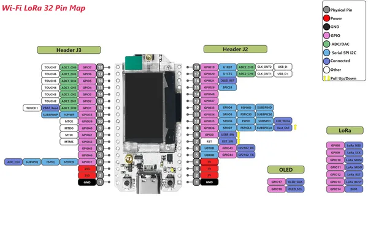

# WiFi LoRa 32 V3.2

**Heltec** · ESP32-S3

Revision: Wi-Fi_LoRa32_V3.2_Pinmap.png  
Coverage: Pinout image collected

[Browse all manufacturers](../../../../BROWSE.md) · [Devices & IoT](../../../../DEVICES.md) · [Open in the browser guide](https://valleytech-black-wire-guide.pages.dev/?board=heltec-esp32-wifi-lora-32-v3-2)

Device category: **Radios & GNSS**

## Board pin reference - Wi-Fi_LoRa32_V3.2_Pinmap

**pinout image** · Reviewed source · PNG

[Open original reference](../../../../library/media/6d602942e6a1c6c819b6ca183b29cba3f4ba392f80eb7e23f0380d3b20dd7a4a.png)

**Credit and rights:** Not established; source attribution retained. Source/manufacturer: Heltec.

[Source 1](https://resource.heltec.cn/download/WiFi_LoRa_32_V3/Wi-Fi_LoRa32_V3.2_Pinmap.png) · [Source 2](https://resource.heltec.cn/download/WiFi_LoRa_32_V3)

Original manufacturer resource filename: Wi-Fi_LoRa32_V3.2_Pinmap.png. Filename and printed revision must be matched to the board.

Image revision: Wi-Fi_LoRa32_V3.2_Pinmap.png

SHA-256: `6d602942e6a1c6c819b6ca183b29cba3f4ba392f80eb7e23f0380d3b20dd7a4a`

Pin assignments have not been independently electrically verified. Check board revision before wiring.
