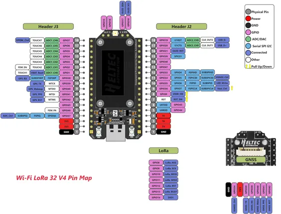

# WiFi LoRa 32 V4

**Heltec** · ESP32-S3

Revision: V4_pinmap.png  
Coverage: Pinout image collected

[Browse all manufacturers](../../../../BROWSE.md) · [Desktop app](https://github.com/valleytechsolutions/black-wire-desktop)

## Board pin reference - V4_pinmap

**pinout image** · Reviewed source · PNG

[Open original reference](../../../../library/media/2562d799970eb2ac231fee0679093e4207019af0800a24b169ae72a98a89988f.png)

**Credit and rights:** Not established; source attribution retained. Source/manufacturer: Heltec.

[Source 1](https://resource.heltec.cn/download/WiFi_LoRa_32_V4/Pinmap/V4_pinmap.png) · [Source 2](https://resource.heltec.cn/download/WiFi_LoRa_32_V4/Pinmap)

Original manufacturer resource filename: V4_pinmap.png. Filename and printed revision must be matched to the board.

SHA-256: `2562d799970eb2ac231fee0679093e4207019af0800a24b169ae72a98a89988f`

Pin assignments have not been independently electrically verified. Check board revision before wiring.
