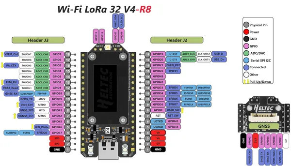

# WiFi LoRa 32 V4-R8

**Heltec** · ESP32-S3

Revision: lora _32_v4-R8 pinmap.png  
Coverage: Pinout image collected

[Browse all manufacturers](../../../../BROWSE.md) · [Devices & IoT](../../../../DEVICES.md) · [Open in the browser guide](https://valleytech-black-wire-guide.pages.dev/?board=heltec-esp32-wifi-lora-32-v4-r8)

Device category: **Radios & GNSS**

## Board pin reference - lora _32_v4-R8 pinmap

**pinout image** · Reviewed source · PNG

[Open original reference](../../../../library/media/2c2339cc9d2f1fa435f52d0dd9203baebd0b0922cdf4d98102be23a87edb9b2e.png)

**Credit and rights:** Not established; source attribution retained. Source/manufacturer: Heltec.

[Source 1](https://resource.heltec.cn/download/WiFi_LoRa_32_V4-R8/pinmap/lora%20_32_v4-R8%20pinmap.png) · [Source 2](https://resource.heltec.cn/download/WiFi_LoRa_32_V4-R8/pinmap)

Original manufacturer resource filename: lora _32_v4-R8 pinmap.png. Filename and printed revision must be matched to the board.

Image revision: lora _32_v4-R8 pinmap.png

SHA-256: `2c2339cc9d2f1fa435f52d0dd9203baebd0b0922cdf4d98102be23a87edb9b2e`

Pin assignments have not been independently electrically verified. Check board revision before wiring.
