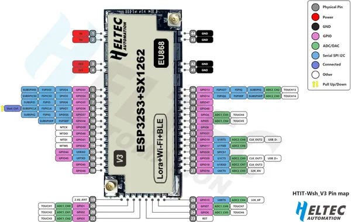

# Wireless Shell V3

**Heltec** · ESP32-S3

Revision: HTIT-Wsh_V3.png

Coverage: Pinout image collected

[Browse all manufacturers](../../../../BROWSE.md) · [Devices & IoT](../../../../DEVICES.md) · [Open in the browser guide](https://valleytech-black-wire-guide.pages.dev/?board=heltec-esp32-wireless-shell-v3)

## Datasheets and original documentation

Board datasheet: **not yet recorded**. Visual reference: **available**.

Original manufacturer website still needs identification.

A chip datasheet, schematic and board datasheet have different scopes. Match the exact hardware revision.

[Documentation coverage and remaining gaps](../../../../DOCUMENTATION.md)

## Board pin reference - HTIT-Wsh_V3

**pinout image** · Reviewed source · PNG

[Open original reference](../../../../library/media/7e277ae4f6657da7a03f143caf5816452927aed0e72c08bea2d80ca0855801b9.png)

**Credit and rights:** Not established; source attribution retained. Source/manufacturer: Heltec.

[Source 1](https://resource.heltec.cn/download/Wireless_Shell_V3/HTIT-Wsh_V3.png) · [Source 2](https://resource.heltec.cn/download/Wireless_Shell_V3)

Original manufacturer resource filename: HTIT-Wsh_V3.png. Filename and printed revision must be matched to the board.

Image revision: HTIT-Wsh_V3.png

SHA-256: `7e277ae4f6657da7a03f143caf5816452927aed0e72c08bea2d80ca0855801b9`

Pin assignments have not been independently electrically verified. Check board revision before wiring.
