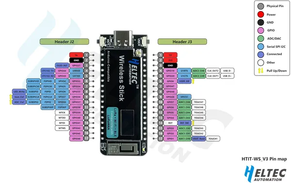

# Wireless Stick V3

**Heltec** · ESP32-S3

Revision: HTIT-WS_V3.png  
Coverage: Pinout image collected

[Browse all manufacturers](../../../../BROWSE.md) · [Devices & IoT](../../../../DEVICES.md) · [Open in the browser guide](https://valleytech-black-wire-guide.pages.dev/?board=heltec-esp32-wireless-stick-v3)

Device category: **Radios & GNSS**

## Board pin reference - HTIT-WS_V3

**pinout image** · Reviewed source · PNG

[Open original reference](../../../../library/media/97eb48f2196f8c4f892053dc16616b67440573be2b936e11ff46cd35742c708f.png)

**Credit and rights:** Not established; source attribution retained. Source/manufacturer: Heltec.

[Source 1](https://resource.heltec.cn/download/Wireless_Stick_V3/HTIT-WS_V3.png) · [Source 2](https://resource.heltec.cn/download/Wireless_Stick_V3)

Original manufacturer resource filename: HTIT-WS_V3.png. Filename and printed revision must be matched to the board.

Image revision: HTIT-WS_V3.png

SHA-256: `97eb48f2196f8c4f892053dc16616b67440573be2b936e11ff46cd35742c708f`

Pin assignments have not been independently electrically verified. Check board revision before wiring.
