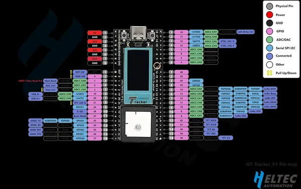

# Wireless Tracker

**Heltec** · ESP32-S3

Revision: Wireless Tracker Pin Map.png  
Coverage: Pinout image collected

[Browse all manufacturers](../../../../BROWSE.md) · [Devices & IoT](../../../../DEVICES.md) · [Open in the browser guide](https://valleytech-black-wire-guide.pages.dev/?board=heltec-esp32-wireless-tracker)

Device category: **Radios & GNSS**

## Board pin reference - Wireless Tracker Pin Map

**pinout image** · Reviewed source · PNG

[Open original reference](../../../../library/media/bc467f850258872f950d9d970ce5146bcc4f07bf9be307dd6a16d02bb8857806.png)

**Credit and rights:** Not established; source attribution retained. Source/manufacturer: Heltec.

[Source 1](https://resource.heltec.cn/download/Wireless_Tracker/Wireless%20Tracker%20Pin%20Map.png) · [Source 2](https://resource.heltec.cn/download/Wireless_Tracker)

Original manufacturer resource filename: Wireless Tracker Pin Map.png. Filename and printed revision must be matched to the board.

Image revision: Wireless Tracker Pin Map.png

SHA-256: `bc467f850258872f950d9d970ce5146bcc4f07bf9be307dd6a16d02bb8857806`

Pin assignments have not been independently electrically verified. Check board revision before wiring.
