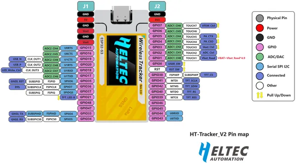

# Wireless Tracker V2.3

**Heltec** · ESP32-S3

Revision: Tracker_v2.3.png  
Coverage: Pinout image collected

[Browse all manufacturers](../../../../BROWSE.md) · [Devices & IoT](../../../../DEVICES.md) · [Open in the browser guide](https://valleytech-black-wire-guide.pages.dev/?board=heltec-esp32-wireless-tracker-v2-3)

Device category: **Radios & GNSS**

## Board pin reference - Tracker_v2.3

**pinout image** · Reviewed source · PNG

[Open original reference](../../../../library/media/81b2e47d94dd0d3a3749c9b89ba46f22f343a8eab5d979bff721454bf4a0a5a3.png)

**Credit and rights:** Not established; source attribution retained. Source/manufacturer: Heltec.

[Source 1](https://resource.heltec.cn/download/Wireless_Tracker_V2/Pin_Map/Tracker_v2.3.png) · [Source 2](https://resource.heltec.cn/download/Wireless_Tracker_V2/Pin_Map)

Original manufacturer resource filename: Tracker_v2.3.png. Filename and printed revision must be matched to the board.

Image revision: Tracker_v2.3.png

SHA-256: `81b2e47d94dd0d3a3749c9b89ba46f22f343a8eab5d979bff721454bf4a0a5a3`

Pin assignments have not been independently electrically verified. Check board revision before wiring.
