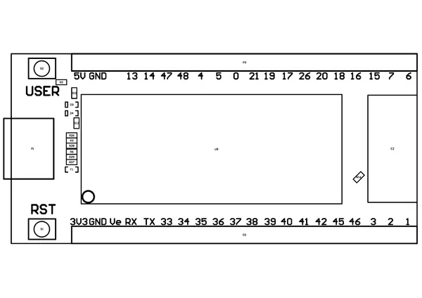
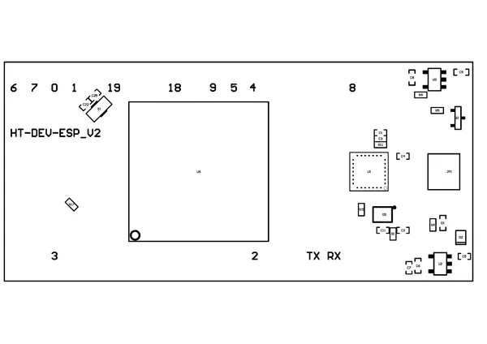

# HT-DEV-ESP V2

**Heltec** · ESP32

Revision: HT-DEV-ESP_V2_DES.pdf

Coverage: Pinout image collected

[Browse all manufacturers](../../../../BROWSE.md) · [Devices & IoT](../../../../DEVICES.md) · [Open in the browser guide](https://valleytech-black-wire-guide.pages.dev/?board=heltec-esp32-ht-dev-esp-v2)

## Datasheets and original documentation

Board datasheet: **not yet recorded**. Visual reference: **available**.

Original manufacturer website still needs identification.

A chip datasheet, schematic and board datasheet have different scopes. Match the exact hardware revision.

[Documentation coverage and remaining gaps](../../../../DOCUMENTATION.md)

## Pinout reference - PDF page 1

**pinout image** · Reviewed source · PNG

[Open original reference](../../../../library/media/7a975d879d8bb39739d7827cda2af03aeb3a700500077cbfa71aed8457a52faa.png)

**Credit and rights:** Not established; source attribution retained. Source/manufacturer: Heltec.

[Source 1](https://resource.heltec.cn/download/HT-DEV-ESP/HT-DEV-ESP_V2_DES.pdf) · [Source 2](https://resource.heltec.cn/download/HT-DEV-ESP)

Original manufacturer resource filename: HT-DEV-ESP_V2_DES.pdf. Filename and printed revision must be matched to the board. Original PDF page 1 rendered at 220 dpi; no labels changed.

Image revision: HT-DEV-ESP_V2_DES.pdf

SHA-256: `7a975d879d8bb39739d7827cda2af03aeb3a700500077cbfa71aed8457a52faa`

## Pinout reference - PDF page 2

**pinout image** · Reviewed source · PNG

[Open original reference](../../../../library/media/255927feed372d1a06619ac8e0e8b86ca1cf7571f01323ae0aaa1f28d2741453.png)

**Credit and rights:** Not established; source attribution retained. Source/manufacturer: Heltec.

[Source 1](https://resource.heltec.cn/download/HT-DEV-ESP/HT-DEV-ESP_V2_DES.pdf) · [Source 2](https://resource.heltec.cn/download/HT-DEV-ESP)

Original manufacturer resource filename: HT-DEV-ESP_V2_DES.pdf. Filename and printed revision must be matched to the board. Original PDF page 2 rendered at 220 dpi; no labels changed.

Image revision: HT-DEV-ESP_V2_DES.pdf

SHA-256: `255927feed372d1a06619ac8e0e8b86ca1cf7571f01323ae0aaa1f28d2741453`

## Board pin reference - HT-DEV-ESP_V2_DES

**original reference PDF** · Reviewed source · PDF

[Open original reference](../../../../library/media/ec12cec3aceb1761589b135ff5adc260fc6f80f92458920d3773ce5f0fdd8c69.pdf)

**Credit and rights:** Not established; source attribution retained. Source/manufacturer: Heltec.

[Source 1](https://resource.heltec.cn/download/HT-DEV-ESP/HT-DEV-ESP_V2_DES.pdf) · [Source 2](https://resource.heltec.cn/download/HT-DEV-ESP)

Original manufacturer resource filename: HT-DEV-ESP_V2_DES.pdf. Filename and printed revision must be matched to the board.

Image revision: HT-DEV-ESP_V2_DES.pdf

SHA-256: `ec12cec3aceb1761589b135ff5adc260fc6f80f92458920d3773ce5f0fdd8c69`

Pin assignments have not been independently electrically verified. Check board revision before wiring.
