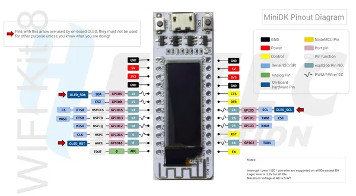

# WiFi Kit 8

**Heltec** · ESP8266

Revision: WIFI_Kit_8_Pinout_Diagram.pdf  
Coverage: Pinout image collected

[Browse all manufacturers](../../../../BROWSE.md) · [Desktop app](https://github.com/valleytechsolutions/black-wire-desktop)

## Pinout reference - PDF page 1

**pinout image** · Reviewed source · PNG

[Open original reference](../../../../library/media/8ba63d1565fe81b97c30d377e86570b225907b49ed3b31fa9531af2e22a6eaff.png)

**Credit and rights:** Not established; source attribution retained. Source/manufacturer: Heltec.

[Source 1](https://resource.heltec.cn/download/WiFi_Kit_8/WIFI_Kit_8_Pinout_Diagram.pdf) · [Source 2](https://resource.heltec.cn/download/WiFi_Kit_8)

Original manufacturer resource filename: WIFI_Kit_8_Pinout_Diagram.pdf. Filename and printed revision must be matched to the board. Original PDF page 1 rendered at 220 dpi; no labels changed.

SHA-256: `8ba63d1565fe81b97c30d377e86570b225907b49ed3b31fa9531af2e22a6eaff`

## Board pin reference - WIFI_Kit_8_Pinout_Diagram

**original reference PDF** · Reviewed source · PDF

[Open original reference](../../../../library/media/a6ad81f30fb2270ca95b7bc200c9fe39d5a56a7037dabd479475da799f305f99.pdf)

**Credit and rights:** Not established; source attribution retained. Source/manufacturer: Heltec.

[Source 1](https://resource.heltec.cn/download/WiFi_Kit_8/WIFI_Kit_8_Pinout_Diagram.pdf) · [Source 2](https://resource.heltec.cn/download/WiFi_Kit_8)

Original manufacturer resource filename: WIFI_Kit_8_Pinout_Diagram.pdf. Filename and printed revision must be matched to the board.

SHA-256: `a6ad81f30fb2270ca95b7bc200c9fe39d5a56a7037dabd479475da799f305f99`

Pin assignments have not been independently electrically verified. Check board revision before wiring.
