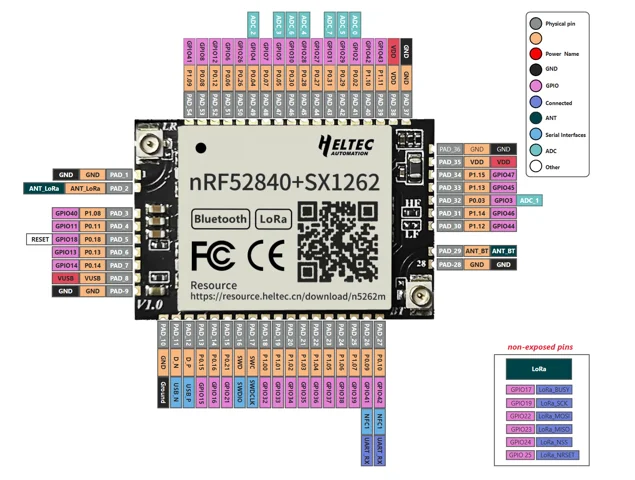

# Mesh Node 5262M (HT-N5262M)

**Heltec** · nRF52840

Revision: PCB revision not established

Coverage: Physical source pinout available; independent completeness review pending

[Browse all manufacturers](../../../../BROWSE.md) · [Devices & IoT](../../../../DEVICES.md) · [Open in the browser guide](https://valleytech-black-wire-guide.pages.dev/?board=heltec-ht-n5262m)

## Datasheets and original documentation

Board datasheet: **not yet recorded**. Visual reference: **available**.

[Original manufacturer / project documentation](https://wiki.heltec.org/docs/devices/open-source-hardware/nrf52840-series/mesh-node-5262m/)

- **schematic / board**: [Schematic diagram](https://resource.heltec.cn/download/HT-N5262M/HT-N5262M_Schematic_Diagram.pdf) · [saved document](../../../../library/media/643568c63b457d0e6282a9b44ffb9dc753e6594dde1830d9017fa35212cbe4f6.pdf)

Source identity and visual scope reviewed. Pin assignments and electrical limits are not independently bench-verified. Match the exact PCB revision, connector view and populated options. Use this exact model and revision. HT-N5262M, T114, T096 and enclosed Mesh Node T1 are separate products. Datasheet tables and schematics are supporting references, not interchangeable physical pinouts. The overview links a missing Datasheet.pdf (HTTP 404); the original pin map and schematic are available. Component datasheets do not replace the missing module datasheet.

[Documentation coverage and remaining gaps](../../../../DOCUMENTATION.md)

## Schematic diagram

**original reference PDF** · Source visual inspected; independent electrical and all-pin completeness review pending · PDF

[Open original reference](../../../../library/media/643568c63b457d0e6282a9b44ffb9dc753e6594dde1830d9017fa35212cbe4f6.pdf)

**Credit and rights:** Heltec Automation / original hardware document contributors. Linked datasheets reserve copyright and restrict commercial copying and distribution without written permission; individual non-commercial download/printing is permitted. Black Wire does not grant commercial reuse or print rights.. Source/manufacturer: Heltec.

[Source 1](https://resource.heltec.cn/download/HT-N5262M/HT-N5262M_Schematic_Diagram.pdf) · [Source 2](https://wiki.heltec.org/docs/devices/open-source-hardware/nrf52840-series/mesh-node-5262m/)

Source identity and visual scope reviewed. Pin assignments and electrical limits are not independently bench-verified. Match the exact PCB revision, connector view and populated options. Use this exact model and revision. HT-N5262M, T114, T096 and enclosed Mesh Node T1 are separate products. Datasheet tables and schematics are supporting references, not interchangeable physical pinouts. The overview links a missing Datasheet.pdf (HTTP 404); the original pin map and schematic are available. Component datasheets do not replace the missing module datasheet.

Image revision: PCB revision not established

SHA-256: `643568c63b457d0e6282a9b44ffb9dc753e6594dde1830d9017fa35212cbe4f6`

## Mesh Node 5262M (HT-N5262M) — manufacturer physical pin map

**pinout image** · Source visual inspected; independent electrical and all-pin completeness review pending · PNG

[Open original reference](../../../../library/media/25c2890c2c96edb653bab8db36fec14e0bed7512106b91954771a2d42c5dd925.png)

**Credit and rights:** Heltec Automation / original hardware document contributors. Linked datasheets reserve copyright and restrict commercial copying and distribution without written permission; individual non-commercial download/printing is permitted. Black Wire does not grant commercial reuse or print rights.. Source/manufacturer: Heltec.

[Source 1](https://resource.heltec.cn/download/HT-N5262M/HT-N5262M_PinMap.png) · [Source 2](https://wiki.heltec.org/docs/devices/open-source-hardware/nrf52840-series/mesh-node-5262m/)

Source identity and visual scope reviewed. Pin assignments and electrical limits are not independently bench-verified. Match the exact PCB revision, connector view and populated options. Use this exact model and revision. HT-N5262M, T114, T096 and enclosed Mesh Node T1 are separate products. Datasheet tables and schematics are supporting references, not interchangeable physical pinouts. The overview links a missing Datasheet.pdf (HTTP 404); the original pin map and schematic are available. Component datasheets do not replace the missing module datasheet.

Image revision: PCB revision not established

SHA-256: `25c2890c2c96edb653bab8db36fec14e0bed7512106b91954771a2d42c5dd925`

Pin assignments have not been independently electrically verified. Check board revision before wiring.
