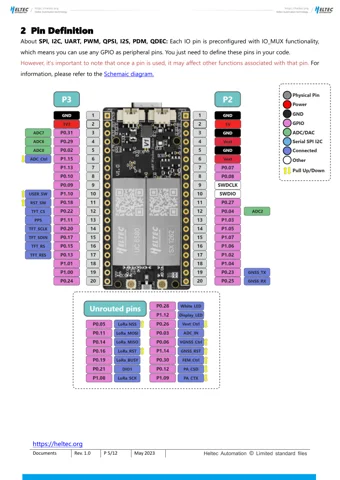

# Mesh Node T096

**Heltec** · nRF52840

Revision: PCB revision not established

Coverage: Physical source pinout available; independent completeness review pending

[Browse all manufacturers](../../../../BROWSE.md) · [Devices & IoT](../../../../DEVICES.md) · [Open in the browser guide](https://valleytech-black-wire-guide.pages.dev/?board=heltec-mesh-node-t096)

Device category: **Radios & GNSS**

Source identity and visual scope reviewed. Pin assignments and electrical limits are not independently bench-verified. Match the exact PCB revision, connector view and populated options. Use this exact model and revision. HT-N5262M, T114, T096 and enclosed Mesh Node T1 are separate products. Datasheet tables and schematics are supporting references, not interchangeable physical pinouts.

## Datasheets and original documentation

Board datasheet: **recorded**. Visual reference: **available**.

[Original manufacturer / project documentation](https://wiki.heltec.org/docs/devices/open-source-hardware/nrf52840-series/t096/)

- **datasheet / board**: [parameters](https://resource.heltec.cn/download/Mesh_Node_T096/Datasheet/Mesh%20Node%20T096.pdf) · [saved document](../../../../library/media/018e5b3c1db7b61da4fa5570448fdf26b3bd8d2c178690cbfac1cd638ec03ef3.pdf)
- **schematic / board**: [Schematic diagram](https://resource.heltec.cn/download/Mesh_Node_T096/Schematic/Mesh_Node_T096_V0.2.pdf) · [saved document](../../../../library/media/f80ad43fca0a4362f8be667d45b92764830b23a57b6ca0850e8996442a8392bc.pdf)

Source identity and visual scope reviewed. Pin assignments and electrical limits are not independently bench-verified. Match the exact PCB revision, connector view and populated options. Use this exact model and revision. HT-N5262M, T114, T096 and enclosed Mesh Node T1 are separate products. Datasheet tables and schematics are supporting references, not interchangeable physical pinouts.

[Documentation coverage and remaining gaps](../../../../DOCUMENTATION.md)

## parameters

**original reference PDF** · Source visual inspected; independent electrical and all-pin completeness review pending · PDF

[Open original reference](../../../../library/media/018e5b3c1db7b61da4fa5570448fdf26b3bd8d2c178690cbfac1cd638ec03ef3.pdf)

**Credit and rights:** Heltec Automation / original hardware document contributors. Linked datasheets reserve copyright and restrict commercial copying and distribution without written permission; individual non-commercial download/printing is permitted. Black Wire does not grant commercial reuse or print rights.. Source/manufacturer: Heltec.

[Source 1](https://resource.heltec.cn/download/Mesh_Node_T096/Datasheet/Mesh%20Node%20T096.pdf) · [Source 2](https://wiki.heltec.org/docs/devices/open-source-hardware/nrf52840-series/t096/)

Source identity and visual scope reviewed. Pin assignments and electrical limits are not independently bench-verified. Match the exact PCB revision, connector view and populated options. Use this exact model and revision. HT-N5262M, T114, T096 and enclosed Mesh Node T1 are separate products. Datasheet tables and schematics are supporting references, not interchangeable physical pinouts.

Image revision: PCB revision not established

SHA-256: `018e5b3c1db7b61da4fa5570448fdf26b3bd8d2c178690cbfac1cd638ec03ef3`

## Schematic diagram

**original reference PDF** · Source visual inspected; independent electrical and all-pin completeness review pending · PDF

[Open original reference](../../../../library/media/f80ad43fca0a4362f8be667d45b92764830b23a57b6ca0850e8996442a8392bc.pdf)

**Credit and rights:** Heltec Automation / original hardware document contributors. Linked datasheets reserve copyright and restrict commercial copying and distribution without written permission; individual non-commercial download/printing is permitted. Black Wire does not grant commercial reuse or print rights.. Source/manufacturer: Heltec.

[Source 1](https://resource.heltec.cn/download/Mesh_Node_T096/Schematic/Mesh_Node_T096_V0.2.pdf) · [Source 2](https://wiki.heltec.org/docs/devices/open-source-hardware/nrf52840-series/t096/)

Source identity and visual scope reviewed. Pin assignments and electrical limits are not independently bench-verified. Match the exact PCB revision, connector view and populated options. Use this exact model and revision. HT-N5262M, T114, T096 and enclosed Mesh Node T1 are separate products. Datasheet tables and schematics are supporting references, not interchangeable physical pinouts.

Image revision: PCB revision not established

SHA-256: `f80ad43fca0a4362f8be667d45b92764830b23a57b6ca0850e8996442a8392bc`

## Mesh Node T096 — physical headers and separately identified unrouted signals, datasheet page 5

**pinout image** · Source visual inspected; independent electrical and all-pin completeness review pending · PNG

[Open original reference](../../../../library/media/8d0765237bb4ee90a8e8ea6316d312f89c3cc5d45ce2d64194af4b24c135a4ff.png)

**Credit and rights:** Heltec Automation / original hardware document contributors. Linked datasheets reserve copyright and restrict commercial copying and distribution without written permission; individual non-commercial download/printing is permitted. Black Wire does not grant commercial reuse or print rights.. Source/manufacturer: Heltec.

[Source 1](https://resource.heltec.cn/download/Mesh_Node_T096/Datasheet/Mesh%20Node%20T096.pdf) · [Source 2](https://wiki.heltec.org/docs/devices/open-source-hardware/nrf52840-series/t096/)

Source identity and visual scope reviewed. Pin assignments and electrical limits are not independently bench-verified. Match the exact PCB revision, connector view and populated options. Use this exact model and revision. HT-N5262M, T114, T096 and enclosed Mesh Node T1 are separate products. Datasheet tables and schematics are supporting references, not interchangeable physical pinouts.

Image revision: PCB revision not established

SHA-256: `8d0765237bb4ee90a8e8ea6316d312f89c3cc5d45ce2d64194af4b24c135a4ff`

Pin assignments have not been independently electrically verified. Check board revision before wiring.
