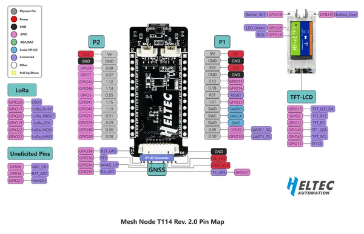

# Mesh Node T114

**Heltec** · nRF52840

Revision: Mesh_node_t114_Pin_Map.png  
Coverage: Pinout image collected

[Browse all manufacturers](../../../../BROWSE.md) · [Devices & IoT](../../../../DEVICES.md) · [Open in the browser guide](https://valleytech-black-wire-guide.pages.dev/?board=heltec-other-mesh-node-t114)

Device category: **Radios & GNSS**

## Board pin reference - Mesh_node_t114_Pin_Map

**pinout image** · Reviewed source · PNG

[Open original reference](../../../../library/media/a2ac3e262769ba4e0a42e475e9be811b7d247843c931a27881f1a47aae0ac5ed.png)

**Credit and rights:** Not established; source attribution retained. Source/manufacturer: Heltec.

[Source 1](https://resource.heltec.cn/download/Mesh_Node_T114/Mesh_node_t114_Pin_Map.png) · [Source 2](https://resource.heltec.cn/download/Mesh_Node_T114)

Original manufacturer resource filename: Mesh_node_t114_Pin_Map.png. Filename and printed revision must be matched to the board.

Image revision: Mesh_node_t114_Pin_Map.png

SHA-256: `a2ac3e262769ba4e0a42e475e9be811b7d247843c931a27881f1a47aae0ac5ed`

Pin assignments have not been independently electrically verified. Check board revision before wiring.
