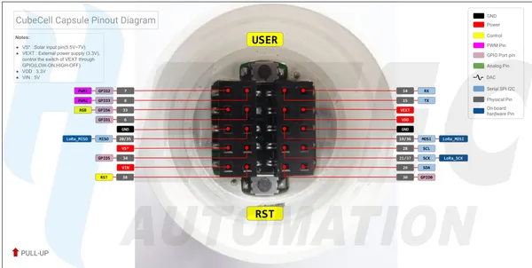

# CubeCell Capsule

**Heltec** · Other

Revision: HTCC-AC01_PinoutDiagram.pdf  
Coverage: Pinout image collected

[Browse all manufacturers](../../../../BROWSE.md) · [Desktop app](https://github.com/valleytechsolutions/black-wire-desktop)

## Pinout reference - PDF page 1

**pinout image** · Reviewed source · PNG

[Open original reference](../../../../library/media/78e689b400647034241bef3a07eb18a87a52f37cf5da8fd70996c913642a27ee.png)

**Credit and rights:** Not established; source attribution retained. Source/manufacturer: Heltec.

[Source 1](https://resource.heltec.cn/download/CubeCell/Capsule/HTCC-AC01_PinoutDiagram.pdf) · [Source 2](https://resource.heltec.cn/download/CubeCell/Capsule)

Original manufacturer resource filename: HTCC-AC01_PinoutDiagram.pdf. Filename and printed revision must be matched to the board. Original PDF page 1 rendered at 220 dpi; no labels changed.

SHA-256: `78e689b400647034241bef3a07eb18a87a52f37cf5da8fd70996c913642a27ee`

## Board pin reference - HTCC-AC01_PinoutDiagram

**original reference PDF** · Reviewed source · PDF

[Open original reference](../../../../library/media/d49bff296ef1f2fe38145e2455b56dd865387449d6bd6d3b382b5f7b69653cb2.pdf)

**Credit and rights:** Not established; source attribution retained. Source/manufacturer: Heltec.

[Source 1](https://resource.heltec.cn/download/CubeCell/Capsule/HTCC-AC01_PinoutDiagram.pdf) · [Source 2](https://resource.heltec.cn/download/CubeCell/Capsule)

Original manufacturer resource filename: HTCC-AC01_PinoutDiagram.pdf. Filename and printed revision must be matched to the board.

SHA-256: `d49bff296ef1f2fe38145e2455b56dd865387449d6bd6d3b382b5f7b69653cb2`

Pin assignments have not been independently electrically verified. Check board revision before wiring.
