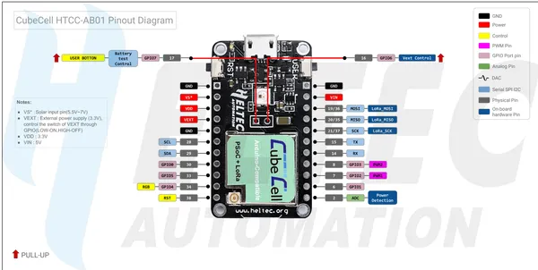

# CubeCell HTCC-AB01

**Heltec** · Other

Revision: HTCC-AB01_PinoutDiagram.pdf  
Coverage: Pinout image collected

[Browse all manufacturers](../../../../BROWSE.md) · [Desktop app](https://github.com/valleytechsolutions/black-wire-desktop)

## Pinout reference - PDF page 1

**pinout image** · Reviewed source · PNG

[Open original reference](../../../../library/media/949753da9b1d810dc1835d60e63596728e49a6c249473a904f82b5df3321cd64.png)

**Credit and rights:** Not established; source attribution retained. Source/manufacturer: Heltec.

[Source 1](https://resource.heltec.cn/download/CubeCell/HTCC-AB01/HTCC-AB01_PinoutDiagram.pdf) · [Source 2](https://resource.heltec.cn/download/CubeCell/HTCC-AB01)

Original manufacturer resource filename: HTCC-AB01_PinoutDiagram.pdf. Filename and printed revision must be matched to the board. Original PDF page 1 rendered at 220 dpi; no labels changed.

SHA-256: `949753da9b1d810dc1835d60e63596728e49a6c249473a904f82b5df3321cd64`

## Board pin reference - HTCC-AB01_PinoutDiagram

**original reference PDF** · Reviewed source · PDF

[Open original reference](../../../../library/media/8ce73d4726589f9edcd1febd8b6eb57b94f6e3afeda754c54ba7c0a2cad414f0.pdf)

**Credit and rights:** Not established; source attribution retained. Source/manufacturer: Heltec.

[Source 1](https://resource.heltec.cn/download/CubeCell/HTCC-AB01/HTCC-AB01_PinoutDiagram.pdf) · [Source 2](https://resource.heltec.cn/download/CubeCell/HTCC-AB01)

Original manufacturer resource filename: HTCC-AB01_PinoutDiagram.pdf. Filename and printed revision must be matched to the board.

SHA-256: `8ce73d4726589f9edcd1febd8b6eb57b94f6e3afeda754c54ba7c0a2cad414f0`

Pin assignments have not been independently electrically verified. Check board revision before wiring.
