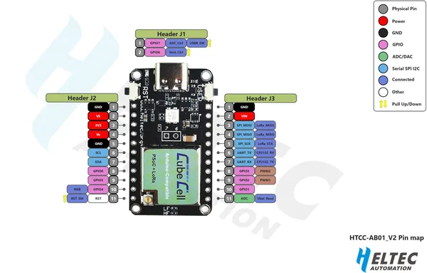

# CubeCell HTCC-AB01 V2

**Heltec** · Other

Revision: HTCC-AB01_V2.png

Coverage: Pinout image collected

[Browse all manufacturers](../../../../BROWSE.md) · [Devices & IoT](../../../../DEVICES.md) · [Open in the browser guide](https://valleytech-black-wire-guide.pages.dev/?board=heltec-other-cubecell-htcc-ab01-v2)

## Datasheets and original documentation

Board datasheet: **not yet recorded**. Visual reference: **available**.

Original manufacturer website still needs identification.

A chip datasheet, schematic and board datasheet have different scopes. Match the exact hardware revision.

[Documentation coverage and remaining gaps](../../../../DOCUMENTATION.md)

## Board pin reference - HTCC-AB01_V2

**pinout image** · Reviewed source · PNG

[Open original reference](../../../../library/media/e6e8722f6b8b82ae59c8c46f3bd018fc025f2f7b986d8d76aed29858557cb9d3.png)

**Credit and rights:** Not established; source attribution retained. Source/manufacturer: Heltec.

[Source 1](https://resource.heltec.cn/download/CubeCell/HTCC-AB01_V2/HTCC-AB01_V2.png) · [Source 2](https://resource.heltec.cn/download/CubeCell/HTCC-AB01_V2)

Original manufacturer resource filename: HTCC-AB01_V2.png. Filename and printed revision must be matched to the board.

Image revision: HTCC-AB01_V2.png

SHA-256: `e6e8722f6b8b82ae59c8c46f3bd018fc025f2f7b986d8d76aed29858557cb9d3`

Pin assignments have not been independently electrically verified. Check board revision before wiring.
