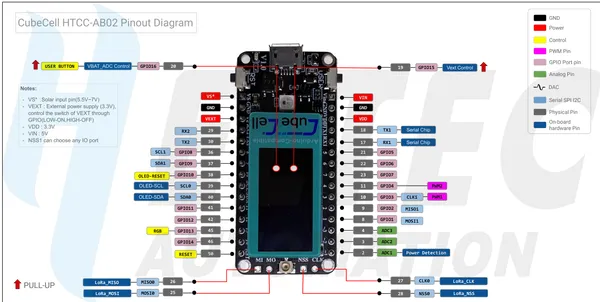

# CubeCell HTCC-AB02

**Heltec** · Other

Revision: HTCC-AB02_PinoutDiagram.pdf  
Coverage: Pinout image collected

[Browse all manufacturers](../../../../BROWSE.md) · [Desktop app](https://github.com/valleytechsolutions/black-wire-desktop)

## Pinout reference - PDF page 1

**pinout image** · Reviewed source · PNG

[Open original reference](../../../../library/media/06d87cf33dd6981e47df336916b82ffbe0990c3ef9d51a94de6b4fd4593f7e9e.png)

**Credit and rights:** Not established; source attribution retained. Source/manufacturer: Heltec.

[Source 1](https://resource.heltec.cn/download/CubeCell/HTCC-AB02/HTCC-AB02_PinoutDiagram.pdf) · [Source 2](https://resource.heltec.cn/download/CubeCell/HTCC-AB02)

Original manufacturer resource filename: HTCC-AB02_PinoutDiagram.pdf. Filename and printed revision must be matched to the board. Original PDF page 1 rendered at 220 dpi; no labels changed.

SHA-256: `06d87cf33dd6981e47df336916b82ffbe0990c3ef9d51a94de6b4fd4593f7e9e`

## Board pin reference - HTCC-AB02_PinoutDiagram

**original reference PDF** · Reviewed source · PDF

[Open original reference](../../../../library/media/b35d0ecc03eb7461f7a5e18e5ac724824a44df5218f7642d7b036b34c5d7e22a.pdf)

**Credit and rights:** Not established; source attribution retained. Source/manufacturer: Heltec.

[Source 1](https://resource.heltec.cn/download/CubeCell/HTCC-AB02/HTCC-AB02_PinoutDiagram.pdf) · [Source 2](https://resource.heltec.cn/download/CubeCell/HTCC-AB02)

Original manufacturer resource filename: HTCC-AB02_PinoutDiagram.pdf. Filename and printed revision must be matched to the board.

SHA-256: `b35d0ecc03eb7461f7a5e18e5ac724824a44df5218f7642d7b036b34c5d7e22a`

Pin assignments have not been independently electrically verified. Check board revision before wiring.
