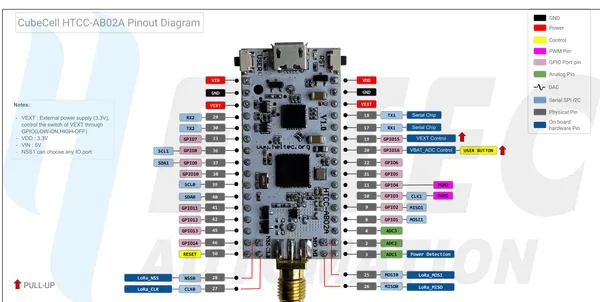

# CubeCell HTCC-AB02A

**Heltec** · Other

Revision: HTCC-AB02A_PinoutDiagram.pdf

Coverage: Pinout image collected

[Browse all manufacturers](../../../../BROWSE.md) · [Devices & IoT](../../../../DEVICES.md) · [Open in the browser guide](https://valleytech-black-wire-guide.pages.dev/?board=heltec-other-cubecell-htcc-ab02a)

## Datasheets and original documentation

Board datasheet: **not yet recorded**. Visual reference: **available**.

Original manufacturer website still needs identification.

A chip datasheet, schematic and board datasheet have different scopes. Match the exact hardware revision.

[Documentation coverage and remaining gaps](../../../../DOCUMENTATION.md)

## Pinout reference - PDF page 1

**pinout image** · Reviewed source · PNG

[Open original reference](../../../../library/media/81adf17bedb8dd08e636cb2064e872d33b77ee6005f3be4b52077516bf88e3c2.png)

**Credit and rights:** Not established; source attribution retained. Source/manufacturer: Heltec.

[Source 1](https://resource.heltec.cn/download/CubeCell/HTCC-AB02A/HTCC-AB02A_PinoutDiagram.pdf) · [Source 2](https://resource.heltec.cn/download/CubeCell/HTCC-AB02A)

Original manufacturer resource filename: HTCC-AB02A_PinoutDiagram.pdf. Filename and printed revision must be matched to the board. Original PDF page 1 rendered at 220 dpi; no labels changed.

Image revision: HTCC-AB02A_PinoutDiagram.pdf

SHA-256: `81adf17bedb8dd08e636cb2064e872d33b77ee6005f3be4b52077516bf88e3c2`

## Board pin reference - HTCC-AB02A_PinoutDiagram

**original reference PDF** · Reviewed source · PDF

[Open original reference](../../../../library/media/910338541d6de3be6ebbea34bb24683f50e0d5e6a694e3b677f9be6143ce12ed.pdf)

**Credit and rights:** Not established; source attribution retained. Source/manufacturer: Heltec.

[Source 1](https://resource.heltec.cn/download/CubeCell/HTCC-AB02A/HTCC-AB02A_PinoutDiagram.pdf) · [Source 2](https://resource.heltec.cn/download/CubeCell/HTCC-AB02A)

Original manufacturer resource filename: HTCC-AB02A_PinoutDiagram.pdf. Filename and printed revision must be matched to the board.

Image revision: HTCC-AB02A_PinoutDiagram.pdf

SHA-256: `910338541d6de3be6ebbea34bb24683f50e0d5e6a694e3b677f9be6143ce12ed`

Pin assignments have not been independently electrically verified. Check board revision before wiring.
