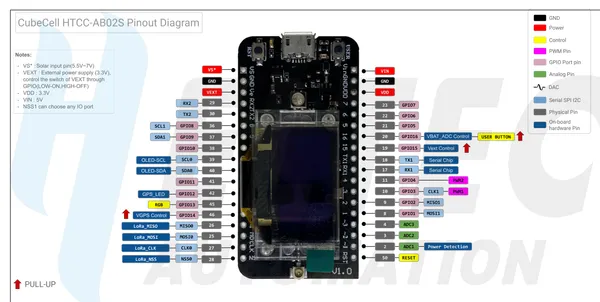

# CubeCell HTCC-AB02S

**Heltec** · Other

Revision: HTCC-AB02S_PinoutDiagram.pdf

Coverage: Pinout image collected

[Browse all manufacturers](../../../../BROWSE.md) · [Devices & IoT](../../../../DEVICES.md) · [Open in the browser guide](https://valleytech-black-wire-guide.pages.dev/?board=heltec-other-cubecell-htcc-ab02s)

## Datasheets and original documentation

Board datasheet: **not yet recorded**. Visual reference: **available**.

Original manufacturer website still needs identification.

A chip datasheet, schematic and board datasheet have different scopes. Match the exact hardware revision.

[Documentation coverage and remaining gaps](../../../../DOCUMENTATION.md)

## Pinout reference - PDF page 1

**pinout image** · Reviewed source · PNG

[Open original reference](../../../../library/media/421ffa2a029c7ea52b65808741ffbeb9e1574d89dd58e20c3a3fa859ce4780b8.png)

**Credit and rights:** Not established; source attribution retained. Source/manufacturer: Heltec.

[Source 1](https://resource.heltec.cn/download/CubeCell/HTCC-AB02S/HTCC-AB02S_PinoutDiagram.pdf) · [Source 2](https://resource.heltec.cn/download/CubeCell/HTCC-AB02S)

Original manufacturer resource filename: HTCC-AB02S_PinoutDiagram.pdf. Filename and printed revision must be matched to the board. Original PDF page 1 rendered at 220 dpi; no labels changed.

Image revision: HTCC-AB02S_PinoutDiagram.pdf

SHA-256: `421ffa2a029c7ea52b65808741ffbeb9e1574d89dd58e20c3a3fa859ce4780b8`

## Board pin reference - HTCC-AB02S_PinoutDiagram

**original reference PDF** · Reviewed source · PDF

[Open original reference](../../../../library/media/d3b855ccc37c9655072b52ab2ca00c95fc1372eb4c038cafe2037a65dcbae961.pdf)

**Credit and rights:** Not established; source attribution retained. Source/manufacturer: Heltec.

[Source 1](https://resource.heltec.cn/download/CubeCell/HTCC-AB02S/HTCC-AB02S_PinoutDiagram.pdf) · [Source 2](https://resource.heltec.cn/download/CubeCell/HTCC-AB02S)

Original manufacturer resource filename: HTCC-AB02S_PinoutDiagram.pdf. Filename and printed revision must be matched to the board.

Image revision: HTCC-AB02S_PinoutDiagram.pdf

SHA-256: `d3b855ccc37c9655072b52ab2ca00c95fc1372eb4c038cafe2037a65dcbae961`

Pin assignments have not been independently electrically verified. Check board revision before wiring.
