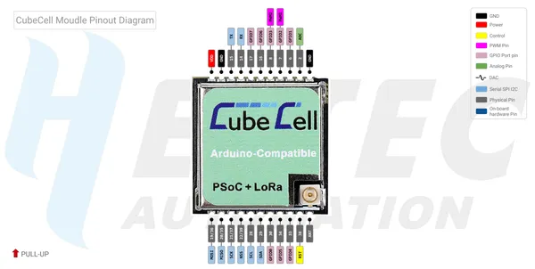

# CubeCell HTCC-AM01 Module Board

**Heltec** · Other

Revision: HTCC-AM01_PinoutDiagram.pdf  
Coverage: Pinout image collected

[Browse all manufacturers](../../../../BROWSE.md) · [Desktop app](https://github.com/valleytechsolutions/black-wire-desktop)

## Pinout reference - PDF page 1

**pinout image** · Reviewed source · PNG

[Open original reference](../../../../library/media/2bcfd92d8683b623f663ac4c2bb81620a062852d46080efd7cdd4e3b78c89f40.png)

**Credit and rights:** Not established; source attribution retained. Source/manufacturer: Heltec.

[Source 1](https://resource.heltec.cn/download/CubeCell/HTCC-AM01_Module/HTCC-AM01_PinoutDiagram.pdf) · [Source 2](https://resource.heltec.cn/download/CubeCell/HTCC-AM01_Module)

Original manufacturer resource filename: HTCC-AM01_PinoutDiagram.pdf. Filename and printed revision must be matched to the board. Original PDF page 1 rendered at 220 dpi; no labels changed.

SHA-256: `2bcfd92d8683b623f663ac4c2bb81620a062852d46080efd7cdd4e3b78c89f40`

## Board pin reference - HTCC-AM01_PinoutDiagram

**original reference PDF** · Reviewed source · PDF

[Open original reference](../../../../library/media/a16f32e52dbf9bd562a8fd7980c233549b7f2f25921861f4f1c5225ef99a0a73.pdf)

**Credit and rights:** Not established; source attribution retained. Source/manufacturer: Heltec.

[Source 1](https://resource.heltec.cn/download/CubeCell/HTCC-AM01_Module/HTCC-AM01_PinoutDiagram.pdf) · [Source 2](https://resource.heltec.cn/download/CubeCell/HTCC-AM01_Module)

Original manufacturer resource filename: HTCC-AM01_PinoutDiagram.pdf. Filename and printed revision must be matched to the board.

SHA-256: `a16f32e52dbf9bd562a8fd7980c233549b7f2f25921861f4f1c5225ef99a0a73`

Pin assignments have not been independently electrically verified. Check board revision before wiring.
