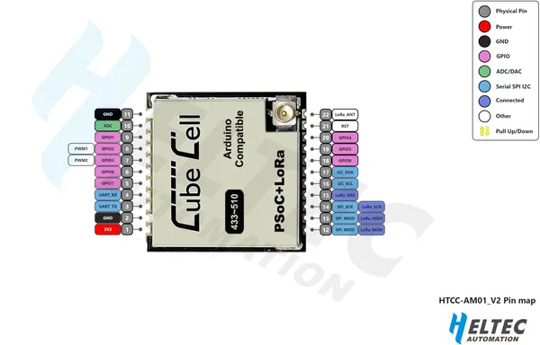

# CubeCell HTCC-AM01 V2

**Heltec** · Other

Revision: HTCC-AM01_V2.png  
Coverage: Pinout image collected

[Browse all manufacturers](../../../../BROWSE.md) · [Desktop app](https://github.com/valleytechsolutions/black-wire-desktop)

## Board pin reference - HTCC-AM01_V2

**pinout image** · Reviewed source · PNG

[Open original reference](../../../../library/media/7988b25aaaf7ca31f81cc57b550e179124e8b752f7daa3f8ff1f8f74d706b9e4.png)

**Credit and rights:** Not established; source attribution retained. Source/manufacturer: Heltec.

[Source 1](https://resource.heltec.cn/download/CubeCell/HTCC-AM01_V2/HTCC-AM01_V2.png) · [Source 2](https://resource.heltec.cn/download/CubeCell/HTCC-AM01_V2)

Original manufacturer resource filename: HTCC-AM01_V2.png. Filename and printed revision must be matched to the board.

SHA-256: `7988b25aaaf7ca31f81cc57b550e179124e8b752f7daa3f8ff1f8f74d706b9e4`

Pin assignments have not been independently electrically verified. Check board revision before wiring.
