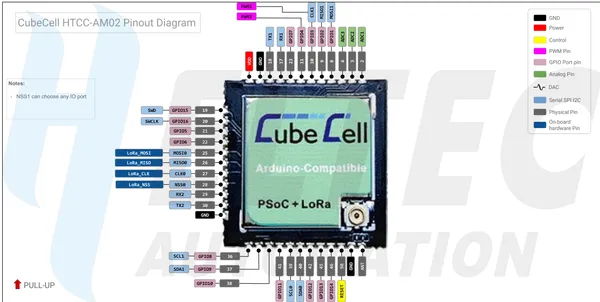

# CubeCell HTCC-AM02 Module Board

**Heltec** · Other

Revision: HTCC-AM02_PinoutDiagram.pdf  
Coverage: Pinout image collected

[Browse all manufacturers](../../../../BROWSE.md) · [Desktop app](https://github.com/valleytechsolutions/black-wire-desktop)

## Pinout reference - PDF page 1

**pinout image** · Reviewed source · PNG

[Open original reference](../../../../library/media/e9f3edcc3155726476d22dc1ea518ea09ef45943221fc9112586a132aa240b11.png)

**Credit and rights:** Not established; source attribution retained. Source/manufacturer: Heltec.

[Source 1](https://resource.heltec.cn/download/CubeCell/HTCC-AM02_Module/HTCC-AM02_PinoutDiagram.pdf) · [Source 2](https://resource.heltec.cn/download/CubeCell/HTCC-AM02_Module)

Original manufacturer resource filename: HTCC-AM02_PinoutDiagram.pdf. Filename and printed revision must be matched to the board. Original PDF page 1 rendered at 220 dpi; no labels changed.

SHA-256: `e9f3edcc3155726476d22dc1ea518ea09ef45943221fc9112586a132aa240b11`

## Board pin reference - HTCC-AM02_PinoutDiagram

**original reference PDF** · Reviewed source · PDF

[Open original reference](../../../../library/media/30daaba8c5d3c1bd24a597478b63068b0f9b8005d46ad074b7d7528c98a778e4.pdf)

**Credit and rights:** Not established; source attribution retained. Source/manufacturer: Heltec.

[Source 1](https://resource.heltec.cn/download/CubeCell/HTCC-AM02_Module/HTCC-AM02_PinoutDiagram.pdf) · [Source 2](https://resource.heltec.cn/download/CubeCell/HTCC-AM02_Module)

Original manufacturer resource filename: HTCC-AM02_PinoutDiagram.pdf. Filename and printed revision must be matched to the board.

SHA-256: `30daaba8c5d3c1bd24a597478b63068b0f9b8005d46ad074b7d7528c98a778e4`

Pin assignments have not been independently electrically verified. Check board revision before wiring.
