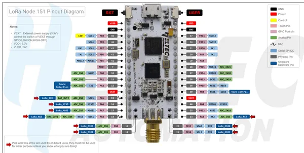

# LoRa Node 151

**Heltec** · Other

Revision: LoRa_Node_151_Pinout_Diagram.pdf  
Coverage: Pinout image collected

[Browse all manufacturers](../../../../BROWSE.md) · [Desktop app](https://github.com/valleytechsolutions/black-wire-desktop)

## Pinout reference - PDF page 1

**pinout image** · Reviewed source · PNG

[Open original reference](../../../../library/media/8acc262cf0ca970a1712e0421dc40fcae3154a14e60ec94394eab9b583bbd749.png)

**Credit and rights:** Not established; source attribution retained. Source/manufacturer: Heltec.

[Source 1](https://resource.heltec.cn/download/LoRa_Node_151/LoRa_Node_151_Pinout_Diagram.pdf) · [Source 2](https://resource.heltec.cn/download/LoRa_Node_151)

Original manufacturer resource filename: LoRa_Node_151_Pinout_Diagram.pdf. Filename and printed revision must be matched to the board. Original PDF page 1 rendered at 220 dpi; no labels changed.

SHA-256: `8acc262cf0ca970a1712e0421dc40fcae3154a14e60ec94394eab9b583bbd749`

## Board pin reference - LoRa_Node_151_Pinout_Diagram

**original reference PDF** · Reviewed source · PDF

[Open original reference](../../../../library/media/1668fa64d0dae121a2ee67c1c74950b36cf77c460d846921586c5174ea0bd2e7.pdf)

**Credit and rights:** Not established; source attribution retained. Source/manufacturer: Heltec.

[Source 1](https://resource.heltec.cn/download/LoRa_Node_151/LoRa_Node_151_Pinout_Diagram.pdf) · [Source 2](https://resource.heltec.cn/download/LoRa_Node_151)

Original manufacturer resource filename: LoRa_Node_151_Pinout_Diagram.pdf. Filename and printed revision must be matched to the board.

SHA-256: `1668fa64d0dae121a2ee67c1c74950b36cf77c460d846921586c5174ea0bd2e7`

Pin assignments have not been independently electrically verified. Check board revision before wiring.
