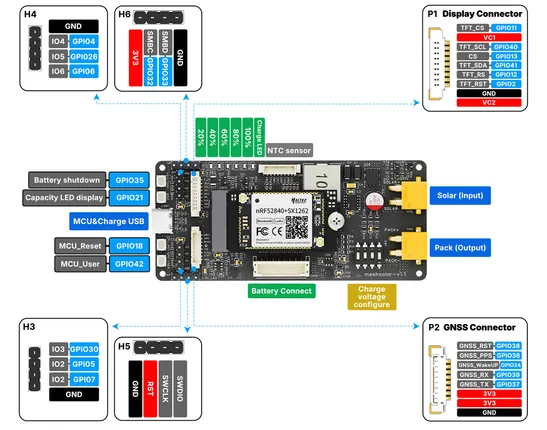

# MeshSolar

**Heltec** · Other

Revision: MeshSolar_pinmap.jpg  
Coverage: Pinout image collected

[Browse all manufacturers](../../../../BROWSE.md) · [Devices & IoT](../../../../DEVICES.md) · [Open in the browser guide](https://valleytech-black-wire-guide.pages.dev/?board=heltec-other-meshsolar)

Device category: **Radios & GNSS**

## Board pin reference - MeshSolar_pinmap

**pinout image** · Reviewed source · JPG

[Open original reference](../../../../library/media/316f4cb05f40adef567ecb726c0ae25a837205e7821ea6a70419a6265cdf8e1f.jpg)

**Credit and rights:** Not established; source attribution retained. Source/manufacturer: Heltec.

[Source 1](https://resource.heltec.cn/download/MeshSolar/Pin_map/MeshSolar_pinmap.jpg) · [Source 2](https://resource.heltec.cn/download/MeshSolar/Pin_map)

Original manufacturer resource filename: MeshSolar_pinmap.jpg. Filename and printed revision must be matched to the board.

Image revision: MeshSolar_pinmap.jpg

SHA-256: `316f4cb05f40adef567ecb726c0ae25a837205e7821ea6a70419a6265cdf8e1f`

Pin assignments have not been independently electrically verified. Check board revision before wiring.
