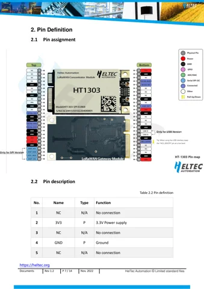

# HT-1303 LoRa gateway module

**Heltec** · SX1303 / SX1250

Revision: PCB revision not established

Coverage: Physical source pinout available; independent completeness review pending

[Browse all manufacturers](../../../../BROWSE.md) · [Devices & IoT](../../../../DEVICES.md) · [Open in the browser guide](https://valleytech-black-wire-guide.pages.dev/?board=heltec-ht-1303)

## Datasheets and original documentation

Board datasheet: **recorded**. Visual reference: **available**.

[Original manufacturer / project documentation](https://wiki.heltec.org/docs/devices/lorawan-application/lora-gateway/ht-1303/)

- **datasheet / board**: [Datasheet](https://resource.heltec.cn/download/HT-1303/HT-1303(Rev.1.2).pdf) · [saved document](../../../../library/media/3a1f0f6d6c0d736b84a4052661861ecf28832aca06f52bbca7a5f3291194e0a5.pdf)
- **schematic / board**: [Reference design](https://resource.heltec.cn/download/HT-1303/HT-1303_Reference_Design.pdf) · [saved document](../../../../library/media/cfd8aa08a00baa9fe2d7d860b05651559dc9e4aaba1e2c29c5fda7e557bf0f65.pdf)

Source identity and visual scope reviewed. Pin assignments and electrical limits are not independently bench-verified. Match the exact PCB revision, connector view and populated options. Use this exact model and revision. HT-N5262M, T114, T096 and enclosed Mesh Node T1 are separate products. Datasheet tables and schematics are supporting references, not interchangeable physical pinouts.

[Documentation coverage and remaining gaps](../../../../DOCUMENTATION.md)

## Datasheet

**original reference PDF** · Source visual inspected; independent electrical and all-pin completeness review pending · PDF

[Open original reference](../../../../library/media/3a1f0f6d6c0d736b84a4052661861ecf28832aca06f52bbca7a5f3291194e0a5.pdf)

**Credit and rights:** Heltec Automation / original hardware document contributors. Linked datasheets reserve copyright and restrict commercial copying and distribution without written permission; individual non-commercial download/printing is permitted. Black Wire does not grant commercial reuse or print rights.. Source/manufacturer: Heltec.

[Source 1](https://resource.heltec.cn/download/HT-1303/HT-1303(Rev.1.2).pdf) · [Source 2](https://wiki.heltec.org/docs/devices/lorawan-application/lora-gateway/ht-1303/)

Source identity and visual scope reviewed. Pin assignments and electrical limits are not independently bench-verified. Match the exact PCB revision, connector view and populated options. Use this exact model and revision. HT-N5262M, T114, T096 and enclosed Mesh Node T1 are separate products. Datasheet tables and schematics are supporting references, not interchangeable physical pinouts.

Image revision: PCB revision not established

SHA-256: `3a1f0f6d6c0d736b84a4052661861ecf28832aca06f52bbca7a5f3291194e0a5`

## Reference design

**original reference PDF** · Source visual inspected; independent electrical and all-pin completeness review pending · PDF

[Open original reference](../../../../library/media/cfd8aa08a00baa9fe2d7d860b05651559dc9e4aaba1e2c29c5fda7e557bf0f65.pdf)

**Credit and rights:** Heltec Automation / original hardware document contributors. Linked datasheets reserve copyright and restrict commercial copying and distribution without written permission; individual non-commercial download/printing is permitted. Black Wire does not grant commercial reuse or print rights.. Source/manufacturer: Heltec.

[Source 1](https://resource.heltec.cn/download/HT-1303/HT-1303_Reference_Design.pdf) · [Source 2](https://wiki.heltec.org/docs/devices/lorawan-application/lora-gateway/ht-1303/)

Source identity and visual scope reviewed. Pin assignments and electrical limits are not independently bench-verified. Match the exact PCB revision, connector view and populated options. Use this exact model and revision. HT-N5262M, T114, T096 and enclosed Mesh Node T1 are separate products. Datasheet tables and schematics are supporting references, not interchangeable physical pinouts.

Image revision: PCB revision not established

SHA-256: `cfd8aa08a00baa9fe2d7d860b05651559dc9e4aaba1e2c29c5fda7e557bf0f65`

## HT-1303 — physical connector pin map, datasheet page 7

**pinout image** · Source visual inspected; independent electrical and all-pin completeness review pending · PNG

[Open original reference](../../../../library/media/b10fd0a45dd8272c97f61c36662ad6c95c4c73b73ce2a43340b628aaa0e8f4b6.png)

**Credit and rights:** Heltec Automation / original hardware document contributors. Linked datasheets reserve copyright and restrict commercial copying and distribution without written permission; individual non-commercial download/printing is permitted. Black Wire does not grant commercial reuse or print rights.. Source/manufacturer: Heltec.

[Source 1](https://resource.heltec.cn/download/HT-1303/HT-1303(Rev.1.2).pdf) · [Source 2](https://wiki.heltec.org/docs/devices/lorawan-application/lora-gateway/ht-1303/)

Source identity and visual scope reviewed. Pin assignments and electrical limits are not independently bench-verified. Match the exact PCB revision, connector view and populated options. Use this exact model and revision. HT-N5262M, T114, T096 and enclosed Mesh Node T1 are separate products. Datasheet tables and schematics are supporting references, not interchangeable physical pinouts.

Image revision: PCB revision not established

SHA-256: `b10fd0a45dd8272c97f61c36662ad6c95c4c73b73ce2a43340b628aaa0e8f4b6`

Pin assignments have not been independently electrically verified. Check board revision before wiring.
