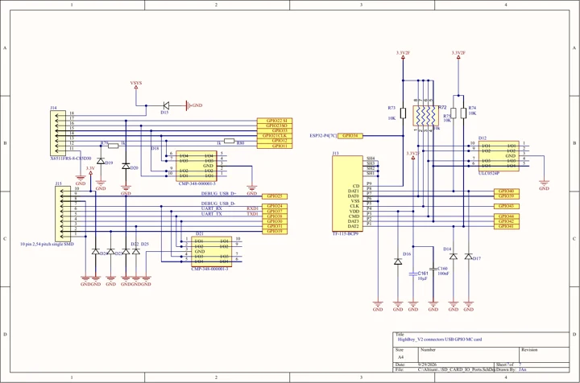

# High Boy V2_03

**High Code** · ESP32-P4 / ESP32-C5

Revision: V2_03 (supplied filename); schematic dated 2026-09-29

Coverage: Updated schematic available; physical connector map still needed

[Browse all manufacturers](../../../../BROWSE.md) · [Devices & IoT](../../../../DEVICES.md) · [Open in the browser guide](https://valleytech-black-wire-guide.pages.dev/?board=high-code-gpio-device-high-boy-production-version)

Device category: **Handhelds & pocket tools**

V2_03 schematic includes prototype annotations; final production status remains unverified. Keep separate from the older REV 2.2 MVP / ESP32-S3 record.

## Datasheets and original documentation

Board datasheet: **not yet recorded**. Visual reference: **available**.

Original manufacturer website still needs identification.

- **schematic / board**: [V2_03 schematic - 2026-09-29 (8 pages) - user-supplied original](https://raw.githubusercontent.com/valleytechsolutions/black-wire-pinouts/82f85064b778528c9c6d49d6b0fe84da8f2b4237/library/media/a364083ece954a77af07d46658813af7794359b5c8aa44560bff01c05c90a7c7.pdf) · [saved document](../../../../library/media/a364083ece954a77af07d46658813af7794359b5c8aa44560bff01c05c90a7c7.pdf)

User-supplied High Boy V2_03 schematic, dated September 29, 2026; eight PDF pages. The filename supplies the V2_03 revision; drawing revision boxes are blank. Original title blocks have inconsistent sheet counts, and the eighth PDF page is the USB/UART sheet. Prototype annotations remain in the source. Production readiness and electrical correctness have not been independently verified. This is a circuit schematic, not a complete physical connector-location pinout. The earlier ESP32-S3 REV 2.2 MVP labels describe different hardware.

[Documentation coverage and remaining gaps](../../../../DOCUMENTATION.md)

## V2_03 schematic - 2026-09-29 (8 pages)

**original reference PDF** · Source identity and all 8 pages visually reviewed; electrical verification pending · PDF

[Open original reference](../../../../library/media/a364083ece954a77af07d46658813af7794359b5c8aa44560bff01c05c90a7c7.pdf)

**Credit and rights:** Not established; user supplied for guide inclusion. Original manufacturer artwork is not relicensed.. Source/manufacturer: High Code.

[Source 1](https://raw.githubusercontent.com/valleytechsolutions/black-wire-pinouts/82f85064b778528c9c6d49d6b0fe84da8f2b4237/library/media/a364083ece954a77af07d46658813af7794359b5c8aa44560bff01c05c90a7c7.pdf)

User-supplied High Boy V2_03 schematic, dated September 29, 2026; eight PDF pages. The filename supplies the V2_03 revision; drawing revision boxes are blank. Original title blocks have inconsistent sheet counts, and the eighth PDF page is the USB/UART sheet. Prototype annotations remain in the source. Production readiness and electrical correctness have not been independently verified. This is a circuit schematic, not a complete physical connector-location pinout. The earlier ESP32-S3 REV 2.2 MVP labels describe different hardware.

Image revision: V2_03 (supplied filename); schematic dated 2026-09-29

SHA-256: `a364083ece954a77af07d46658813af7794359b5c8aa44560bff01c05c90a7c7`

Pin assignments have not been independently electrically verified. Check board revision before wiring.
