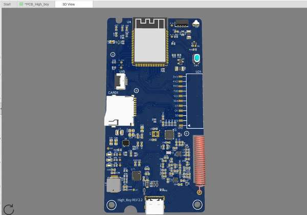

# High Boy REV 2.2 MVP

**High Code** · ESP32-S3

Revision: REV 2.2 MVP; not final production  
Coverage: Partial pinout collected; full reference still needed

[Browse all manufacturers](../../../../BROWSE.md) · [Desktop app](https://github.com/valleytechsolutions/black-wire-desktop)

## REV 2.2 prototype connector signal labels

**pinout image** · Reviewed source · PNG

[Open original reference](../../../../library/media/c5e11b49a7c395434bbe335cff2b4acd41be9db8dc6cc55992bfadeb83237c53.png)

**Credit and rights:** Not established; source attribution retained. Source/manufacturer: High Code.

[Source 1](https://raw.githubusercontent.com/HighCodeh/Highboy_PCB/8b7bdd2ce3fc7f0ed818b3f54d6a01c30e5a0ce3/pics/pcb_render.png) · [Source 2](https://github.com/HighCodeh/Highboy_PCB)

Manufacturer labels this design as an MVP prototype, not the final production version. Preserve that distinction.

**Partial diagram. Confirm missing pins against the exact board documentation.**

SHA-256: `c5e11b49a7c395434bbe335cff2b4acd41be9db8dc6cc55992bfadeb83237c53`

Pin assignments have not been independently electrically verified. Check board revision before wiring.
