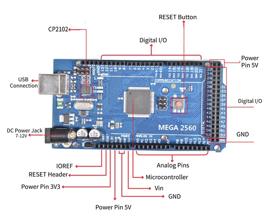

# Inland MEGA2560 CP2102 kit board

**Inland** · ATmega2560

Revision: Not identified

Coverage: Supporting documentation; physical pinout still needed

[Browse all manufacturers](../../../../BROWSE.md) · [Devices & IoT](../../../../DEVICES.md) · [Open in the browser guide](https://valleytech-black-wire-guide.pages.dev/?board=inland-mega2560-cp2102-kit)

## Datasheets and original documentation

Board datasheet: **not yet recorded**. Visual reference: **available**.

[Original manufacturer product documentation](https://microcenter.zendesk.com/hc/en-us/articles/24427882877975-Inland-Super-Learning-Kit-for-Arduino-Community)

- **hardware-guide / board**: [Model specifications and hardware reference](https://microcenter.zendesk.com/hc/en-us/articles/24427882877975-Inland-Super-Learning-Kit-for-Arduino-Community) · online

Archived kit guide identifies CP2102. The diagram labels connector groups, not every pin; separate from newer CH340 retail SKU.

[Documentation coverage and remaining gaps](../../../../DOCUMENTATION.md)

## Specifications and hardware documentation

- [Original model specifications](https://microcenter.zendesk.com/hc/en-us/articles/24427882877975-Inland-Super-Learning-Kit-for-Arduino-Community)

## Archived MEGA2560 connector-group overview

**board labeling image** · Reviewed source · PNG

[Open original reference](../../../../library/media/03f92ff3ad113fda2007364cd90b96a8898a984ec0f0b81909c4aeecac4d03b0.png)

**Credit and rights:** Inland / original artwork contributors. Asset-specific redistribution and print rights are not established. Black Wire's editorial license does not relicense this artwork.. Source/manufacturer: Inland.

[Source 1](https://us.v-cdn.net/6031942/uploads/1F0XYTFXU93O/image.png) · [Source 2](https://microcenter.zendesk.com/hc/en-us/articles/24427882877975-Inland-Super-Learning-Kit-for-Arduino-Community)

Original source reviewed for model and visual type. Pin assignments and electrical limits have not been independently verified. Match the PCB revision before wiring.

Image revision: Not identified

SHA-256: `03f92ff3ad113fda2007364cd90b96a8898a984ec0f0b81909c4aeecac4d03b0`

Pin assignments have not been independently electrically verified. Check board revision before wiring.
